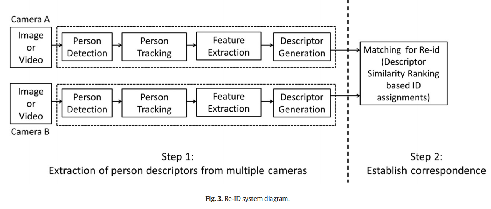
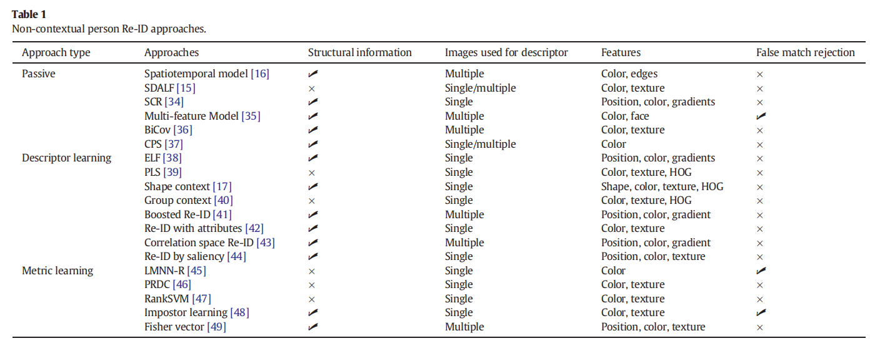

# A survey of approaches and trends in person re-identification

## 摘要

行人重识别主要是给某个摄像头拍摄的一个人的一张图片或一段视频，从另外的摄像头获取的图片或视频中识别出这个人。在多个摄像机之间甚至在同一摄像机内建立一致的标签以在跟踪时对丢失的人重新标识必不可少。本文揭示了行人重识别的问题和当前的解决方案，通过讨论进一步研究的潜在方向，突出了未解决的问题和问题的挑战。

## 简介

当一个人从一个摄像头的视野范围移动到另外的摄像头的视野范围，Re-ID用于完成跨多个摄像机的跟踪。Person Re-ID是一项艰巨的任务，但对于提高分析的语义一致性至关重要。Re-ID也与使用单个摄像机的监视应用程序相关。例如，确定某人是否多次访问特定位置，或者同一人或不同人是否捡起无人看管的包裹/袋子。除了监视之外，它还具有机器人技术，多媒体以及更流行的实用程序（例如自动照片标记或照片浏览）中的应用程序

### 行人重识别的任务与挑战

最大的挑战在于同一个人在摄像头中的外观也是不同的。

#### 系统级挑战
典型的Re-ID系统可能具有图像（单张）或视频（多张）作为特征提取和描述符生成的输入。对于图像输入，必须可靠地检测到该人并对其进行定位，以进行准确的特征提取。如果有多个图像可用，为了确保提取的特征属于感兴趣的人，需要能够跨帧在检测到的主题之间建立对应关系。此过程也称为跟踪，它在多个帧中为每个对象提供一致的标签。因此，一个人的多个实例可以用于特征提取和随后的描述符生成以用于Re-ID。

#### 组件级挑战：描述符问题

假设可以进行准确的人员检测和单摄像机跟踪，则Re-ID的第一步是学习人员的视觉特征。需要从不受约束的环境中捕获的数据中提取健壮而有区别的视觉描述符，在这些环境中人们可能无法合作并且环境不受控制。此外，由于人群或混乱，人们可能会部分或完全被遮挡。由于分辨率，帧速率，成像条件和成像角度等因素千差万别，无法始终加以控制，因此很难确保高质量的视觉数据。因此，提取可靠的描述符取决于高质量观察的可用性。错误的检测和错误的轨迹估计会在描述符提取和生成过程中引入错误，直接影响Re-ID的质量。

最简单的特征就是外观特征，如颜色和纹理。形状是另一个可提取的描述符。Re-ID也分为短期Re-ID与长期Re-ID。

#### 组件级挑战：对应问题

一个人的外观特征由于背包、衣服、正面、背面等是不一样的（即不同时候同一个人的外观是可以不同的）；不同的人的外观甚至可以是相似的。这意味着把这个作为分类问题，类内差距可能很大，而类间的差距可能相对较小。 在大量的潜在候选人中比较人物描述符是一项艰巨的任务，因为这些描述符是在不同的位置，时刻和不同的持续时间内捕获的。 随着候选数目的增加导致描述符特异性的丧失，匹配过程的复杂性进一步增加，从而增加了匹配错误的可能性。这也是一个计算和内存密集的过程。

### 人员Re-ID方案

Re-ID系统与识别系统比较类似，都由一个已知图片库(Gallery Set)和一个待匹配图片库(Probe Set)组成。

记gallery set为$G = (g_1,g_2,...,g_N)$，这个库的图片ID为$id(G) = (id(g_1),id(g_2),...,id(g_N))$，函数$id(.)$指定分配给其参数的ID

记probe set为$P = (p_1,p_2,...,p_M)$，这些未知id为$id(P) = (id(p_1),id(p_2),...,id(p_M))$

在识别中，gallery中图片与被查询图片的相似度被排序来判断probe的ID，Closed set Re-ID的probe中的人都在gallery的中，$id(P) \subset id(G)$，对于一个给定的probe $p_j$正确的probe ID为$id(p_j) = id(g_{i*})$，其中$i* = argmaxp{\atop i \in 1,\cdots,N}(g_i|p_j)$，其中$p(g_i|p_j)$是$id(p_j) = id(g_i)$的可能性，常用相似度表示。

在Open set Re-ID中，先要判断probe ID是否在gallery中，如果在就查询真实ID，且要满足$p(g_{i*}|p_j)>\tau$，$\tau$是可接受的确定性水平，高于该水平时，可以合理保证$id(p_j) \subset id(G)$。若该probe并不在gallery中，就将其添加进去。监测一个从未见过的ID叫做新奇检测(novelty detection)

### 当前Re-ID中的工作

在几乎所有的研究中，Re-ID问题都被广泛视为检索或识别问题。给定一个或多个未知人物（探针）的图像或由多个已知人物组成的画廊集，目标是根据与未知人物的视觉相似性，生成画廊中所有人物的排名列表。当前大多数方法都依靠图像之间基于外观的相似性来建立对应关系，用于量化外观的典型特征是从衣服中提取的低级别的颜色和纹理特征。当前的SOTA基本都是处理短期的重识别任务。总的来说，近来的方法集中在解决方案的两个方面：1）设计区分性，描述性和鲁棒性的视觉描述符来表征人的外表； 2）学习适当的距离度量，以最大程度地增加正确匹配的机会。

#### 基于上下文的方法

这些方法依赖于外部上下文信息来修剪对应关系或提取Re-ID的特征。它们可以进一步分类为利用相机几何信息或将相机校准作为上下文的方法。

##### 相机几何关系作为上下文

Re-ID的早期工作主要集中在利用相机之间的时空关系，以通过限制画廊的大小来减少Re-ID错误。 利用时空提示来学习摄像机之间的关系，进而将其用于约束摄像机之间的对应关系。这些关系被建模为时空参数的概率密度函数，例如进入和退出位置，速度以及相机之间的过渡时间。有文章使用MAP估计使用相似的方法来校准摄像机网络并估计网络中目标的轨迹。也有文章使用人的轨迹的传播来识别相机内未观察到的区域中的关注区域。这些区域还用于选择人们可能采取的潜在路径，从而限制了后续摄像机FOV中的重现区域来约束Re-ID

##### 相机校准作为上下文

利用摄像机标定或单应性来提取独特的判别特征，以增强用于Re-ID的视觉描述符。有的文章使用基于单应性的3D位置估计来确定人的身高。人体轮廓从顶部到底部按斑点高度的指定比例分为三部分。然后，每个区域都由主要颜色和边缘能量纹理描述符表示。集成的区域匹配用于人体轮廓相似度计算以实现Re-ID。

使用全景外观图(panoramic appearance ma,PAM)，几何所有摄像头内的目标特征给出单个目标的特征。但是目标至少要在三个视角互相重叠的相机内部可见。

检测每个人的主轴，即人体的对称轴，以匹配各个摄像机视图中的人。 由两个摄像机共享的地平面上的地标用于估计单应性。 使用单应性图，一个视图中人的主轴与另一视图中人的变换的主轴的交点用于计算来自不同摄像机的人之间的匹配程度。 匹配度用于计算对应可能性以建立Re-ID。 然而，检测到的主轴的精度取决于从前景对人的轮廓的精确分割，因此在拥挤的场景和混乱的背景中易于出错。

这些方法都依赖于相机的校准，在布设大量摄像头网络的时并不现实。

#### 非基于上下文的方法

##### 被动方法

基于颜色和形状特征的外观模型。斑点被分割成多个极坐标区域，每个区域的彩色高斯模型和边缘像素计数构成了描述符。使用三个相似性度量来建立匹配，并且最佳匹配是使所有相似性度量最大化的匹配。

使用基于分水岭分割和图划分的时空分割算法来检测稳定的时空边缘，称为edgels。人的外观是颜色（色相和饱和度）和Edgel直方图的组合，并且相交直方图用于建立观察值之间的匹配。

人的轮廓由两个互补的外观特征表示。第一个是HSV直方图，可对全局外观进行编码，而局部外观是通过使用一组循环局部斑块编码的。外观匹配基于特征相似度的加权和。 这些特征是从一个人的多个图像中提取的，称为直方图加缩影(HPE)。通过检测两个水平不对称轴和一个垂直对称轴，人体轮廓分为头部，躯干和腿部区域。然后使用3个特征(加权HSV直方图，最大稳定颜色区域(MSCR)和经常出现的高纹理局部斑块)描述每个部分。提取的特征在一个人的多个图像上进行组合，以形成称为SDALF的外观模型。

从人体部位提取空间协方差区域（SCR），并使用空间金字塔匹配来设计相异性度量。基于HOG的身体部位检测器用于检测4个部位：躯干，左臂，右臂和腿。每个检测到的身体部位都具有基于区域颜色，梯度大小和方向的协方差描述符。协方差矩阵距离用于计算描述符之间的差异。

利用在人的多个图像上收集的基于兴趣点的描述符来表征人的外表。 使用有效的积分图像实现来检测基于Hessian的兴趣点。使用绝对差之和度量对描述符进行匹配，并在包含所有画廊模型的KD树上使用最佳bin优先（BBF）搜索来建立Re-ID。

一种基于HS颜色直方图和代表色的基于零件的时空模型。使用基于HOG的身体部位检测器将人的身体分为稳定的身体部位。提取每个身体部位的颜色直方图，然后将其合并为受活动外观模型启发的活动颜色模型。

基于FisherFaces的面部特征和亮度-色度空间（LCC）中颜色的密集采样以及衣服的水平和垂直边缘在中被组合用于Re-ID。

##### 主动方法

基于学习的方法

###### 颜色匹配

这些方法尝试使用颜色校准技术对给定相机对之间的颜色关系进行建模，并且它们需要学习需要经常更新以捕获所有所需关系的校准模型。为了模拟两个摄像机之间物体外观的变化，从训练数据输入中学习每对摄像机之间的亮度传递函数(BTF)。

###### 特征学习

使用形状和外观上下文模型，其中先验学习的形状和外观单词之间的出现形成了人描述符。使用改进的形状上下文算法将人的轮廓分为多个部分，该算法建立在先验学习的形状字典的基础上。基于特征包的方法用于学习编码词以基于对数RGB空间中计算出的HOG特征来表征外观。

使用局部和全局空间关系（组上下文）的相似出现词和视觉上下文用于描述个人的出现。出现词基于SIFT和平均RGB颜色作为特征。人群由两个描述符表示。第一个目的是描述在以该组为中心的矩形环区域之内和之间的出现词的比率信息。第二个描述符捕获标签之间的更多局部空间信息。通过组合人员描述符匹配成本和组匹配成本，将获得的组描述符用作人员Re-ID的上下文提示。

Cai和Pietikinen利用关于学习到的出现词的自我相似性的空间分布，并将它们组合起来以形成出现描述符。出现词基于加权的色调直方图，然后针对每个标签，计算其在以图像中心为中心的对数极坐标网格的每个bin中的出现频率。它用作全局颜色上下文表示，以建模图像模式的自相似性。使用最近邻居分类器在人图像之间建立Re-ID。

采用Adaboost学习技术来同时学习区分特征和弱分类器（ELF）的集合，以进行行人识别。

二元SVM分类器被训练来学习特定于摄像机对的分类器特征空间的变化，用于训练SVM的特征是通过将给定摄像机对中人的外观描述符进行串联来形

**基于属性的人员重新识别**

一种基于特征的固有属性来学习不同特征的自适应权重的无监督方法，属性被定义为具有附加语义的中级特征或视觉概念，即：条纹，毛发，高大，矮小等等；独特或显着的区域被定义为区分一个人的外表的区域，并且足以在不同的视角识别该人，这些区域可以是与众不同的质感背包或鲜艳的夹克。

###### 距离矩阵的学习

学习一种图像特征定义的空间中的度量标准，以使来自同一类别的特征距离更近，而来自不同类别的特征距离更远。在Re-ID中，特征是不同摄像头下的外观描述。

记要学习的外观描述为$x_1, x_2, \dots, x_n$，每个样本的维度为m，矩阵度量学习就是学习一个距离矩阵，记作$D \in R^{m*m}$，两个特征$x_i, x_j$的距离定义为：$d(x_i,x_j) = (x_i-x_j)^TD(x_i-x_j)$，只要矩阵D是对称正半定的，那么$d(x_i,x_j)$就是真实的度量。

大余量最近邻居（LMNN-R）距离度量使真实匹配之间的距离最小化，而虚假匹配距离最大。在对它们进行主成分分析以降低尺寸后，使用8个bin的RGB和HSV直方图计算了成本。获悉的度量具有根据匹配成本的通用获知阈值拒绝匹配的能力。

一种称为概率相对距离学习（PRDC）的概率方式解决了度量学习。他们专注于最大程度地提高正确配对对比不正确配对对的距离的可能性。 Re-ID被强制转换为Tracklet匹配问题，动态时间规整距离被用作度量标准以匹配Tracklet。采用基于动态时间规整距离的大余量最近邻度量学习。

基于集合的判别排序（SBDR）模型，其中画廊人和探测器的图像序列之间的距离是使用它们的近似凸包的几何距离来计算的。 采用基于最大余量的排名方案，该方案使真实匹配对之间的距离小于错误匹配对。 度量学习过程是一个迭代过程，因此计算量很大。

于高斯混合模型的图像强度，颜色，位置和梯度的7维特征被提取并表示。 它们与加权的HSV直方图和稳定的颜色区域结合在一起。 适用于高维数据的基于稀疏成对约束的距离度量学习用于Re-ID

通过将对应检测作为两类分类问题，使用Mahanolobis度量距离学习。学习发生在距离空间中，每个点只有两个标签。换句话说，同一个人的不同视图之间的距离具有相同的标签。通过放宽对学习矩阵的正性约束，可以简化上述优化问题，而无需进行多次迭代。人员图像被分为重叠的矩形区域，并从每个区域提取HSV，实验室颜色和LBP，以形成用于学习度量的人员描述符。

使用大余量最近邻居框架学习了类似的成对度量。在学习过程中，训练数据中难以与匹配样本分离的样本将被赋予更高的优先级。这些样本在距离空间中侵入配对对的周边时被称为冒名顶替者（Impostor学习）。

## 数据集（略）

## 公开的问题

1、长期的Re-ID
2、Re-ID的性能测试
3、