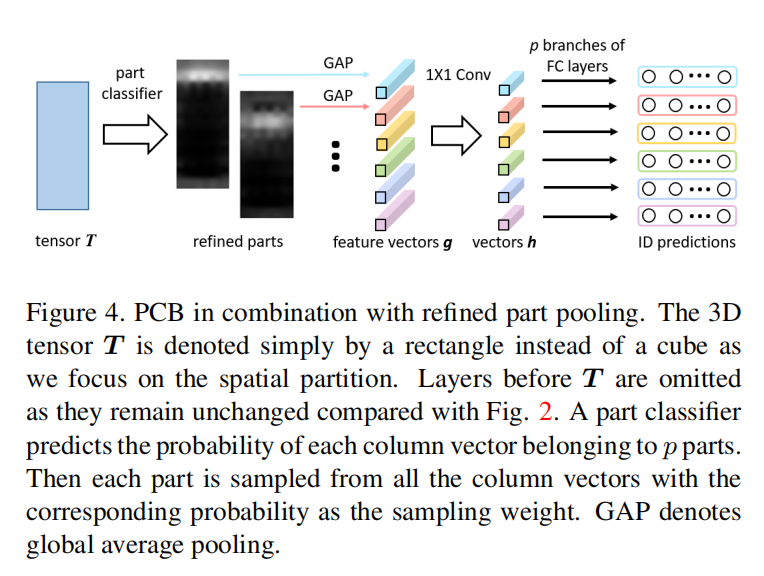
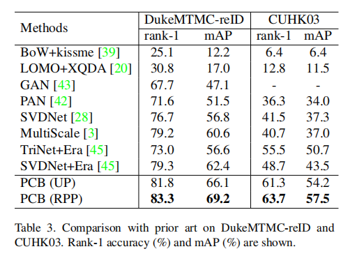

# Beyond Part Models: Person Retrieval with Refined Part Pooling (and A Strong Convolutional Baseline)

## 摘要

使用行人图像描述的部分功能可提供细粒度的信息，本文的目标是学习具有区别性的部分特征以供检索，并做出两个贡献（1）一个被称为基于部分的卷积基线(Part-based Convolutional Baseline, PCB)，输入一张图片，它将输出一系列part级别特征的卷积描述。（2）一个精炼部分卷积(refined part poolint, RPP)方法，统一的分区不可避免地会在每个部分中产生离群值，而离群实际上更类似于其他部分。 RPP将这些离群值重新分配给它们最接近的部分，从而使精制部分的内部一致性得到增强。

## 简介

## 相关研究

### 手工设计的用于行人检索的部分特征

1、捕捉颜色与纹理特征的水平条带，2、将人体分为许多三角形来取得部分特征描述；3、采用图片结构将行人解析为语义部分；4、在头部，躯干和腿部应用HSV直方图以捕获空间信息

### 基于深度学习的部分特征

首先，学习出的特征有更强的描述能力；其次，深度学习为解析行人提供了更好的工具，这进一步使部分特征发挥作用。特别是人体姿势估计和关键点检测取得了令人瞩目的进展。

将最大激活的坐标聚集在特征图上，以找到几个感兴趣的区域。

将注意力机制嵌入网络中，允许模型自行决定将注意力集中在哪里。

### 具有注意力机制的深度学习部分

对比本文的RPP与PAR

**动机**：PAR旨在直接学习对齐的part，而RPP则旨在完善预先分区的part

**工作机理**：PAR使用注意力方法，以无监督的方式训练part分类器，而RPP的训练可以看作是半监督的过程。

**训练过程**：RPP首先训练具有均匀划分的身份分类模型，然后利用所学知识来诱导part分类器的训练。

## PCB：一个健壮的卷积基线

### PCB的结构

#### 骨架网络

PCB可以使用任何去掉隐藏全连接层的图像分类网络作为骨架网络，本文使用ResNet50

#### 从骨架网络到PCB

如下图所是，在全局平均池化(global average pooling, GAP)之前的结构与骨架网络一致。不同点在于GAP层及其后的部分被移除了。图片经过这些层后成为一个3D的张量T，文中设定为列向量。然后通过一个卷积平均池化，PCB将张量T转换为$p$个水平条带且平均没一列的向量值到一个条带能为一个单独的part级别的列向量$g_i(i=1,2,\dots,p)$。接下来，PCB使用一个卷积层来为$g$降维为$h$。最后每个$h_i$被送入由全连接层接上softmax函数的分类器来预测输入的ID值。

在训练期间，通过最小化$p$个ID预测的交叉熵损失之和来优化PCB

#### 一些可用于替代的结构

平均所有的$h_i$为单一向量$\overline{h}$，然后对$\overline{h}$用全连接分类预测ID值

### 精炼部分池化(Refined Part Pooling)

PCB的均匀分区简单，有效，但有待改进。本节首先解释均匀分隔伴随的不一致现象，然后提出改进的part合并作为加强part内部一致性的补救措施。

#### part内不一致

着眼于要在空间上划分的张量T，我们对部分内不一致的直觉是：T的相同部分中的列向量f应该彼此相似，并且与其他部分中的列向量不相似；否则会出现part内部不一致的现象，这意味着part分配不当。所做的就是对每个条带中的各部分进行聚类。

#### 重新定位离群值

提出改进的part池化以纠正part内部的不一致。 目标是根据所有列向量的相似度将它们分配给每个部分，以便对异常值进行重新定位。

基于学习到的张量T，使用softmax后接一个线性层的结构作为part分类器：

$P(P_i|f) = softmax(W^T_if) = \frac{exp(W^T_if)}{\sum_{j=1}^p exp(W^T_j)}$，其中$P(P_i|f)$是$f$属于$P_i$部分的预测概率，$p$是与定义parts的个数，$W$是分类器的可训练的权重矩阵。

给定$T$中的列向量$f$和属于部分$P_i$的$f$的预测概率，我们将$P(P_i|f)$作为置信度将$f$分配给部分$P_i$。每一个部分$P_i(i=1,2,\dots,p)$是从所有的列向量$f$中以$P(P_i|j)$作为采样权重采样出来的，如：
$P_i = \{P(P_i|f)*f,\forall f \in F\} $，其中$F$是$T$中的列向量的一个复杂集合，$\{.\}$代表采样操作。通过执行此操作，建议的精炼part池化将进行“软”和自适应分区，以精炼原始的“硬”和统一分区，并且源自统一分区的异常值将被重新定位。

#### part分类器的归纳训练

$W$的训练如下：

1.训练一个标准的PCB模型来，使其与等分的$T$收敛

2.在$T$之后移除原始的平均池化层，增加一个$p$类的part分类器

3.固定已训练好的PCB层，只训练part分类器。然后将此模型重新在训练集上训练。

4.最后，所有的层都允许更新，整个个PCB被微调

## 实验

### 数据集和设置

实验在Market-1501，DukeMTMC-reID，CUHK03数据集分别进行

### 实现细节

#### 实现IDE进行比较

##### PCB是一个强健的baseline

##### RPP提高了PCB的mAP

##### 使用$p$损失的好处

对每个part采用各自的损耗对于学习区分part的特征至关重要

##### 在分类时不共享参数的好处

##### 与前沿研究的对比

文章算法达到的结果为：mAP = 81.6%, 69.2%, 57.5% and Rank-1 = 93.8%, 83.3% and 63.7% for Market-1501, Duke and CUHK03,

### 参数分析

首先，较大的图像尺寸有利于学习的part特征。mAP和rank-1精度都随图像大小而增加，直到达到稳定的性能。

其次，较小的下采样率，即张量T的较大空间大小会增强性能，尤其是在使用相对较小的图像作为输入时。

### 归纳和注意机制

通过归纳学习的精炼部分优于通过注意力机制学习的部分。具有归纳和注意力机制的分区结果如下所示：

## 总结

本文首先提出用于学习part特征的PCB，使用了简单的统一分配策略和结合part特征到卷积描述符中。文章使用精炼部分池化的方法，以增强每个part的part内部一致性。经过精炼之后，相似的列向量被统计到一个part中，使每个part更加内联。精制的part池化不需要part标签信息，并大大改善了PCB。

