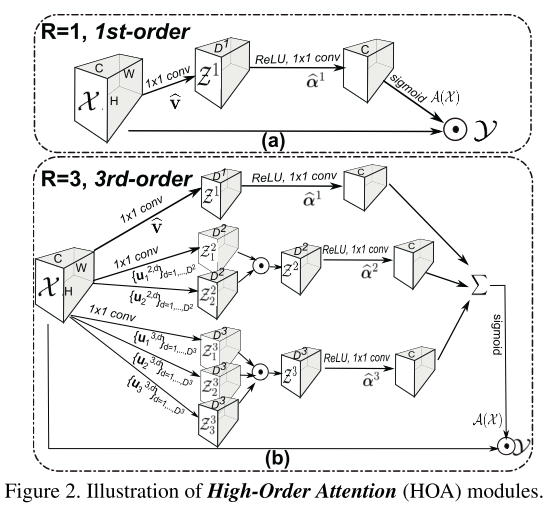
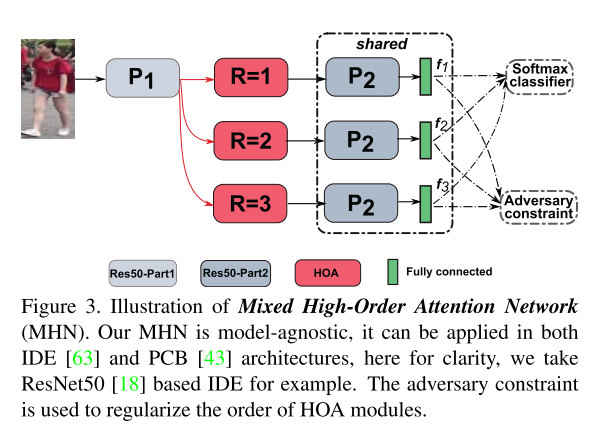
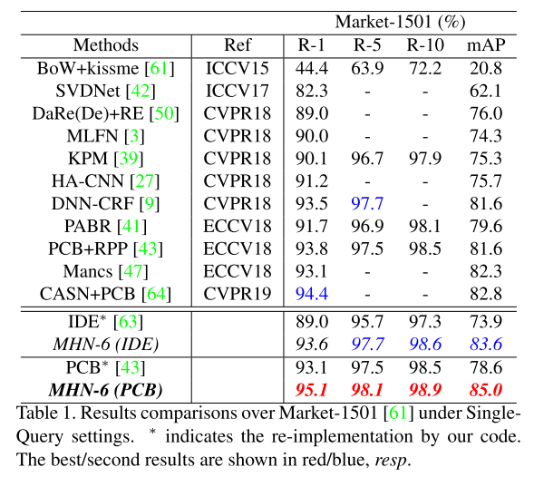

# Mixed High-Order Attention Network for Person Re-Identification

论文地址：https://arxiv.org/abs/1908.05819?context=cs.CV

本文把ReID看作zero-shot的问题。提到channel attention和spatial attention有局限性：
（1）channel attention：只关注了channel的关系，对于spatial的特征没有很好的效果
（2）spatial attention：空间mask的处理策略比较粗糙，对调制细粒度的channel feature没有影响

这些常用的注意力方法（即空间和通道注意力）要么是粗糙的，要么是一阶的，仅限于挖掘简单而粗糙的信息，在某些人的ReID情况下，它们不足以捕获视觉部分的复杂/高级交互作用以及由各种视点/人的姿势引起的行人之间的细微差别，因此，生成的注意力图既不具有区分性也不具有详细性

本文提出一种混合顺序attention的结构（Mixed High-Order Attention Network, MHN），使用多个MOA模块对不同阶采用不同策略attention

HOA使用常见的1*1conv和tensor的内积、求和等实现，channel attention module作为第一阶模块

可以嵌入到IDE和PCB的baseline网络中

