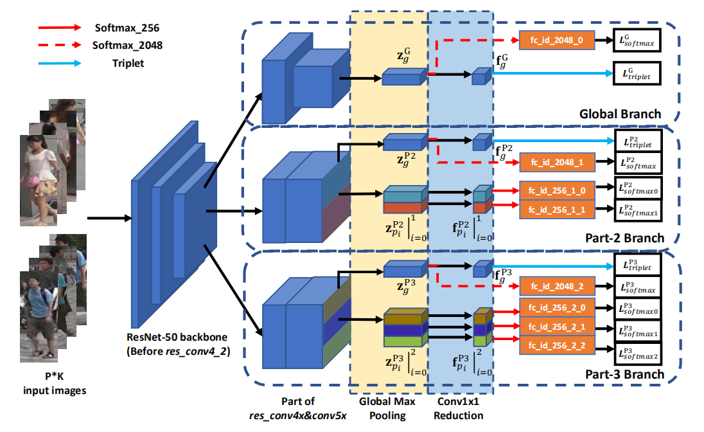

# Learning Discriminative Features with Multiple Granularities

## Guanshuo Wang1, Yufeng Yuan, Xiong Chen, Jiwei Li, Xi Zhou

## 摘要

设计了一种多重粒度网络(Multiple Granularity Network, MGN)，一种多分支深度网络体系结构，包括一个用于全局要素表示的分支和两个用于局部要素表示的分支。

## 正文

基于局部的方法可分为以下三种：

（1）定位具有强大结构信息的部分区域，例如关于人体的经验知识或基于学习的强大姿势信息；

（2）通过区域提案方法定位局部区域

（3）通过对显著分区的中层关注来提高性能

本文提出了一种以不同粒度结合全局和局部信息的特征学习策略

损失函数在特征学习中用作监督信号

### 损失函数

Softmax+TripletLoss

$$L_{triplet} = -\sum_{i=1}^{P}\sum_{a=1}^{K}[\alpha + max_{p=1 \dots K}||f_a^(i)-f_p^(i)||_2-min_{n=1 \dots K,j=1 \dots P,j \neq i}||f_a^(i)-f_n^(i)||_2]_+$$

对全局特征使用tripletloss，对局部特征使用softmax。此设置的灵感源于粗略到精细的机制，将非归约特征作为粗略信息来学习分类，将归约特征作为具有学习度量的精细信息。

将局部与整体在同一个分支中学习得到的效果并不显著。可能是这个分支共享同一个网络结构。

网络体系结构中的三个分支实际上学习了表示具有不同偏好的信息。 具有较大接收场和全局最大池的全局分支从行人图像中捕获了完整但粗糙的特征，并且由第2部分和第3部分分支学到的特征却没有大幅度的卷积和条带的分割部分，但这些特征往往是局部的但很好。 具有更多分区的分支将学习行人图像的更好表示。 学习不同偏好的分支机构可以将底层的区分信息协作地补充到公共骨干网部分，这就是在任何单个分支机构中提高性能的原因。