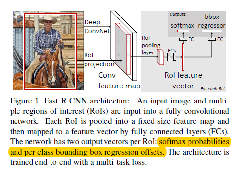

# Fast R-CNN

## 解决的问题
### R-CNN 
#### 缺点:
1.训练过程是两阶段的

2.训练对时间和空间需求高，使用SVM分类器

3.推理速度慢

#### 原因：

对每一个目标都进行了卷积计算，没有共享卷积结果

### SPPNet
SPPNet针对R-CNN的问题共享了卷积结果以提速，同时在空间金字塔池化中，不同大小的输出通过池化后串接起来。

#### 缺点：
1.训练过程是多阶段的

2.使用SVM分类器，实践空间需求高

3.微调算法法不能更新空间金字塔池之前的卷积层参数

## Fast R-CNN:
使用CNN对整个图片获得特征图，然后对每个目标生成一个预选区域池化层，每个特征向量送入一系列全连接层，然后分两个分支，一个使用softmax计算$K$个物体类别的概率，另一个分支输出bounding box的值。

### RoI pooling layer
RoI pooling layer使用最多池化将任何有效感兴趣区域内的特征转换为具有固定空间范围HW的小特征图，其中H和W是超参数

### 多任务学习
第一个输出：$K + 1$个类别上的离散概率分布($K$类，$1$个背景)

第二个输出：bounding box 回归结果，$t^k=(t^k_x,t^k_y,t^k_w,t^k_h)$，其中$k$是第$k$类的索引

每个RoI都标有真实类$u$和真实边界框回归目标$v$

多任务学习loss：

$$L(p,u,t^u,v)=L_{cls}(p,u)+\lambda[u \geq 1 ]L_{loc}(t^u,v)$$

其中$L_{cls}(p,u)=-\log p_u$，$L_{loc}$定义为目标$u$的一组正确的真实边界框的回归目标$v=(v_x,v_y,v_w,v_h)$，和一个预测元组$t^u=(t^u_x,t^u_y,t^u_w,t^u_h)$，对边界框回归，使用$L_{loc}=\sum_{x \in \{x,y,w,h\}} smooth_{L_1}(t^u_i-v_i)$，其中$smooth_{L_1}(x) = \begin{cases}
0.5x^2& \text{if |x|<1}\\
|x|-0.5& \text{otherwise}
\end{cases}$

$\lambda$控制两个loss的权重，将边界框回归目标做0均值归一化，实验中$\lambda=1$

### 尺度不变
1）“蛮力”学习（2）图像金字塔

### 截断的SVD
通过使用截断的SVD压缩，可以轻松地加速大型全连接层

