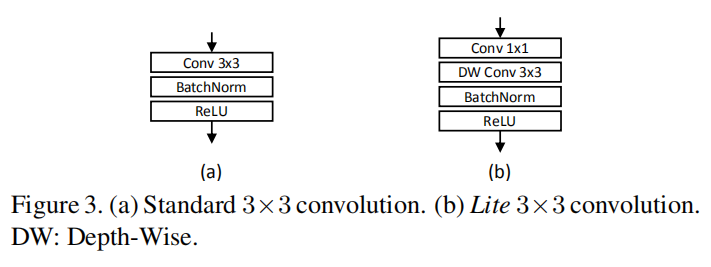

# Omni-Scale Feature Learning for Person Re-Identification

## 摘要

行人重识别依赖于判别式特征，这些同质 或异质的特征被称为omni-scale特征。这篇论文设计了一种新颖的深度CNN，称为全方位网络（ Omni-Scale Network，OSNet），用于ReID中的全方位特征学习。这是通过设计由多个卷积特征流组成的残差块来实现的，每个残差块都以一定比例检测特征。 重要的是，引入了一种新颖的统一汇聚门，以动态融合多尺度特征和与输入有关的通道权重。为了有效地学习空间通道相关性并避免过度拟合，构件块同时使用了点向和深度卷积。

## 简介

行人重识别的两大挑战是（1）因为不同摄像头的视角造成类内差变化大；（2）很多类间的变化比较小（人们穿着差不多的衣服等）

为了克服这两个挑战，ReID的关键在于学习判别式特征，本文认为需要提取全方位特征，也就是多样化的同质和异质的分块的结合。

当前的ReID模型都没有做全方位特征学习。本文提出OSNet，每个流关注的特征比例由指数决定，指数是一个新的尺寸因数，在整个流中线性增加，以确保在每个块中捕获各种比例。至关重要的是，通过统一汇聚门（AG）生成的通道权重将生成的多尺度特征图动态融合。AG是一个子网，可在所有流之间共享参数，并具有许多有效的模型训练所需属性。使用可训练的AG，生成的通道权重将取决于输入，因此实现了动态标度融合。

OSNet是一个轻量级的网络，它可带来以下好处：（1）轻量级网络具有更少的模型参数，不容易过拟合（2）在大型监视应用程序中（例如，使用数千个摄像头的城市范围的监视），ReID的唯一实用方法是在摄像头端执行特征提取。对于设备上的处理，小型ReID网络显然是首选。

## 相关工作

### 深度ReID架构
已有的绝大多数深度ReID CNN目标架构是针对通用对象分类问题，比如ImageNet等。最近，引入了一些体系结构修改以反映以下事实：ReID数据集中的图像仅包含一个对象类别（即人），而人大多是直立的。为了利用直立的身体姿势，[5，20，21，22]将辅助监督信号添加到从最后一个卷积特征图水平合并的特征中。[4，23，2]设计注意力机制，将特征学习集中在前景人物区域。在[24、25、6、26、27]中，借助于现成的姿态检测器来学习特定于身体部位的CNN。 在[28、29、30]中，CNN化成分支以学习全局和局部图像区域的表示。

### 多尺度和多流深度特征学习
全方位深度特征学习之前并未介绍过，尽管如此，最近已经认识到多尺度特征学习的重要性，并且还采用了多流构建块设计。具体来说，[1]中的图层设计基于ResNeXt [33]，其中每个流以相同的比例学习特征，而我们每个块中的流具有不同的比例。我们的构建块严格遵循比例递增模式，以捕获各种空间比例。此外，[8]仅在最后一个程序块之后，才将多流功能与可学习但固定一次学习的流权重融合在一起

### 轻量级网络设计
随着嵌入式AI成为热门话题，轻量级的CNN设计越来越受到关注。SqueezeNet [36]使用1×1卷积压缩特征尺寸。 IGCNet [37]，ResNeXt [33]和CondenseNet [38]利用了群卷积。 Xception [39]和MobileNet系列[9，10]基于深度可分离卷积。

## 全方位特征学习

### 分解卷积
将标准的卷积层分为两层：点式卷积和深度卷积

$u \in R^{1*1*c*c'}$是点式卷积核，$v \in R^{k*k*1*c'}$是深度卷积核
计算代价从$h*w*k^2*c*c'$降低到$h*w*(k^2+c)*c'$，参数数量从$k^2*c*c'$降低到$(k^2+c)*c'$

### 全尺寸残渣块
我们使用残差块构建网络体系，同时使用我们的轻量级3*3层。给定一个输入$x$，bottleneck是为了学习一个$\widetilde{x}$，使得$y = x +  \widetilde{x}, \widetilde{x} = F(x)$，F是一个Lite 3*3层学习single-scale特征（scale=3）。为了实现全方位的学习，我们通过引入新的维t来扩展残差函数F，该维t表示特征的尺度。
$F^t$的大小为$(2t+1,2t+1)$，$\widetilde{x} = \sum_{t=1}^TF^t(x)$

### 统一汇聚门
到目前为止，每个流都可以为我们提供特定比例的特征，即它们是比例均匀的。 为了学习全尺度特征，文章建议以动态方式组合不同流的输出，即根据输入图像将不同的权重分配给不同的尺度，而不是在训练后固定。 更具体地说，动态标度融合是通过新型聚合门（AG）实现的，该门是可学习的神经网络。
用$x^t$标记$F^t(x)$，omni-scale的$\widetilde{x}$定义如下：

$\widetilde{x} = \sum^T_{t=1}G(x^t)@x^t,x^t := F^t(x)$

$G(x^t)$是一个向量，长度跨越$x^t$的整个通道尺寸，@表示Hadamard积。G被实现为一个微型网络，该微型网络由非参数全局平均池化层和具有一个ReLU激活隐藏层的多层感知器（MLP）组成，然后进行Sigmoid激活。 为了减少参数开销，我们遵循[42，43]来通过设置为16的缩小率来缩小MLP的隐藏维。
AG在所有的特征流中都是共享的。
