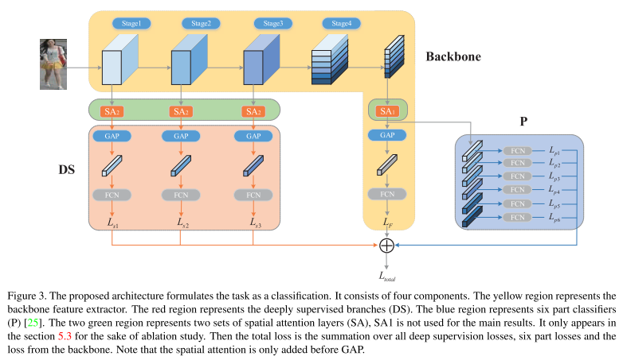

# Parameter-Free Spatial Attention Network for Person Re-Identification

论文地址：http://arxiv.org/abs/1811.12150

本文针对GAP获取到的特征缺失进行了优化，设计了Spatial Attention机制，在GAP之前对feature map的各通道进行如下操作：

featur map可视化如下：

再对操作后的feature map进行GAP+FCN计算crossentropyloss

整体网络采用PCB为baseline，网络结构如下：

GAP本身可以减少计算量，SA操作仅用了softmax激活函数，模型计算复杂度并未增加

实验发现spqtial和channel的attention是相互关联的

最终结果用了rerank，PCB+RPP是未rerank的，所以结果存疑

