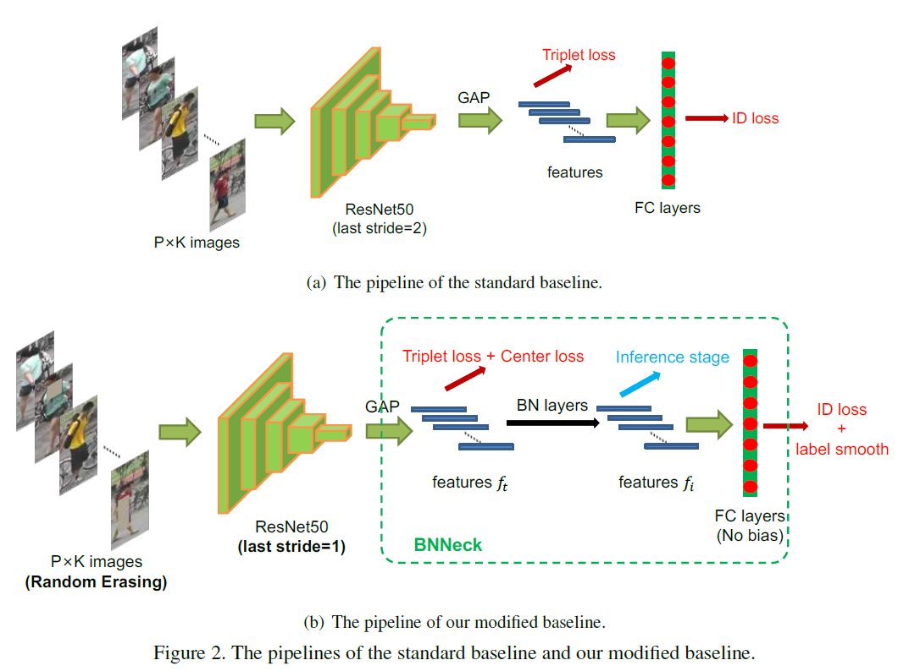
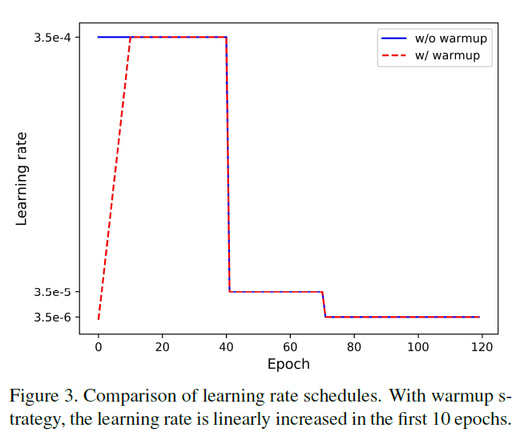
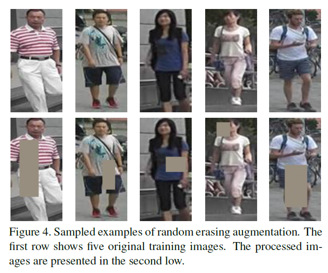
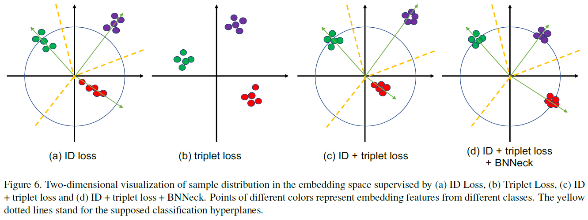
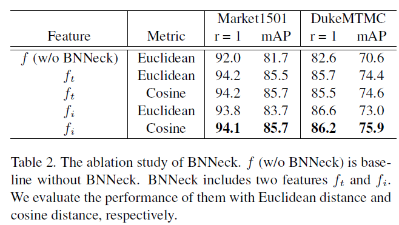
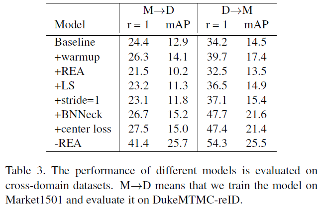
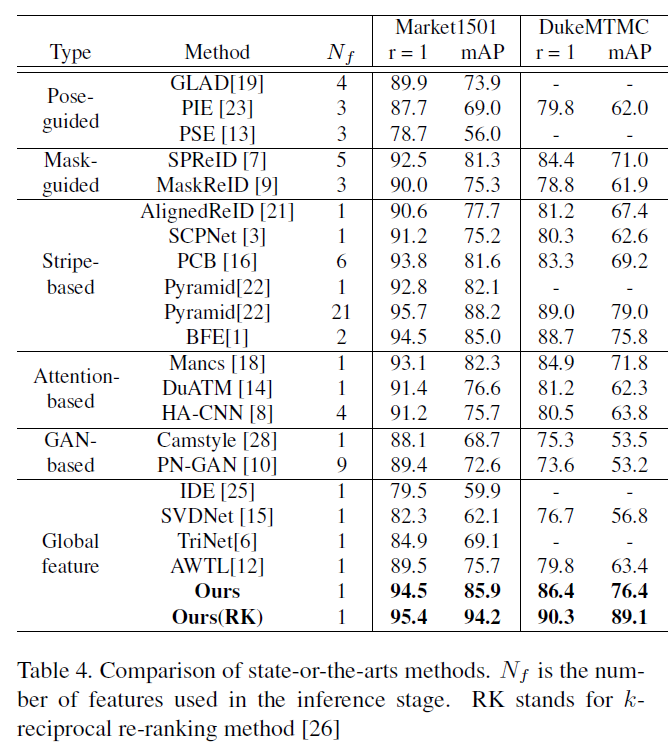
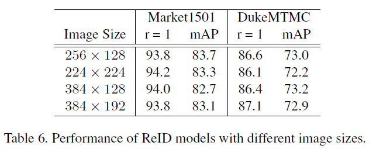

# Bag of Tricks and A Strong Baseline for Deep Person Re-identification

Hao Luo, Youzhi Gu, Xingyu Liao, Shenqi Lai, Wei Jiang
Zhejiang University, Chinese Academy of Sciences, Xi’an Jiaotong University

## 摘要

本文提出一个ReID中简单且有效的baseline。本文使用一些trick，在只使用全局特征的情况下达到rank1 94.5%和mAP 85.9%的水平。

## 简介

当前大部分的工作都在性能不太好的baseline上进行，本文下网提供一个强力的baseline给研究者和社区来推动ReID的发展。

本文集合了一些高效的训练方法并设计了一个BNNeck。

## 标准baseline

骨干网络是ResNet50，训练中有以下五个步骤：

1、使用在ImageNet上预训练好的ResNet50参数，并将最后的全连接层的输出改为$N$（训练集中id数）

2、每个批次随机采样$P$个人的$K$张图片进行训练，batch size 为$B = P * K$，本文设计$P = 16, K= 4$

3、将每张图片resize到$256*128$并向外用0补充10个像素，在随机裁剪到$256*128$

4、每张图片以50%的概率水平翻转

5、每张图片呗编码为介于[0,1]的32位浮点数的像素值，然后归一化RGB通道

6、模型输出ReID特征$f$和ID预测标签$p$

7、ReID特征$f$呗用来计算triplet loss，ID预测$p$用来计算cross entropy loss。triplet loss的margin设为0.3

8、使用Adam方法来对模型进行最优化，初始学习率设为0.00035，在40epoch和70epoce时衰减0.1，一共训练120轮

## 训练trick

Fig2(b)显示了这一部分所描述的训练策略

### 预热学习率（Warmup）

### 随机擦除增强(RandomErasing, REA)

### 标签平滑(LabelSoomth, LS)

ID嵌入（IDE）[25]网络是ReID的基本基线。IDE的最后一层，输出图像的ID预测对数，是一个全连接层，其隐藏大小等于人数N。给定图像，我们将$y$表示为真$ID$标签，将$p_i$表示为$ID$预测日志。 交叉熵损失的计算公式为：

$$L(ID) = \sum^N_{i=1}-q_ilog(p_i) \begin{cases}
q_i = 0,\quad y \neq i \\\\
q_i = 1,\quad y = i
\end{cases}$$

由于分类的类别是由人员ID决定的，因此本文将这种损失函数称为ID损失。

文献[17]中提出的标签平滑（LS）是一种广泛使用的方法，用于防止过度拟合分类任务。它将$q_i的$构造更改为：

$$q_i = \begin{cases}
1-\frac{N-1}{N}\varepsilon,i=y \\\\
\frac{\varepsilon}{N},otherwise
\end{cases}$$

$\varepsilon$是一个小常数，可以鼓励模型对训练集失去信心。本文中设置$\varepsilon = 0.1$

### 最后一层的步长(Last Stride)

在[16]中，Sun等人。 删除了骨干网中最后的空间下采样操作，以增加特征图的大小。

### BNNeck

大多数的工作结合了ID loss和triplet loss来训练ReID模型。标准baseline中，ID loss和triplet loss使用同样的特诊$f$。但是，这两个损失的目标在嵌入空间中不一致。

如图6（a）所示，ID loss构造了几个超平面，以将嵌入空间分成不同的子空间。

每个类的特征分布在不同的子空间。这种情况下cos距离比欧式距离更加啊事故和ID loss的优化。

另一方面，triplet loss增强了欧几里得空间内的类内紧密度和类间可分离性。由于三重态损失不能提供全局最优约束，因此类间距离有时小于类内距离。更广泛的做法是把ID loss和triplet loss结合到一起来进行训练。然而，对于嵌入空间中的图像对，ID损失主要是优化余弦距离，而三重态损失则集中在欧几里得距离上。 如果我们使用这两个损失来同时优化特征向量，则它们的目标可能不一致。 在训练过程中，一种可能的现象是一种损失减少了，而另一种损失正在振荡甚至增加。

为了解决这个问题，文章提出BNNeck(Fig5(b))，BNNeck只是在特征后加一个BN层，BN层之前的特征定义为$f_t$，BN后的特征$f_i$，训练过程中，$f_t$和$f_i$u用于计算triplet loss和ID loss。归一化平衡了fi的每个维度。 特征在高球表面附近呈高斯分布。 这种分布使ID损失更易于收敛。 另外，BNNeck减少了ID损失对ft的约束。ID损失的较少约束导致三重态损失更易于同时收敛。 归一化保持了属于同一个人的特征的紧凑分布。

由于超球面几乎是围绕坐标轴的原点对称的，因此BNNeck的另一招是消除分类器FC层的偏置。

### Center Loss

Triplet loss计算方式为：
$$L_{Tri} = [d_p - d_n + \alpha]_+$$

其中$d_p$和$d_n$是正样本对和负样本对的距离，$\alpha$是triplet loss的边界，$[z]_+$等于$max(z,0)$。本文中，$\alpha$设为0.3.

Center loss同时学习了每个类别的深层特征的中心并惩罚了深层特征与其对应的类中心之间的距离，弥补了三重态损失的缺点。其定义为：$L_C = \frac{1}{2}\sum^B_{j=1}||f_{t_j}-c_{y_j}||^2_2$，其中$y_j$是mini-batch中第j个图片的label，$c_{y_j}$是第$y_i$个类的深度特征中心。使中心损失最小化可提高类内紧凑性。本文中模型包括三部分:

$$L = L_{ID} + L_{Triplet} + \beta L_C$$

其中$\beta$是评委center loss的权重，实验中设为0.0005

## 实验结果

### 各个trick的影响（单域）

### 对BNNeck的分析

余弦距离度量的$f_t$优于欧几里德距离度量的$f_t$。由于ID损失直接约束了BN层之后的特征，因此$f_i$可以被几个超平面清楚地分开。 余弦距离可以测量两个特征向量之间的角度，因此对于$f_i$，余弦距离度量比欧几里得距离度量更合适。 但是，$f_t$接近triplet loss，并且同时受到ID损失的限制。 两种度量标准可以实现类似$f_t$的性能。总的来说，BNNeck可以极大提高ReID模型的性能。

### 每个Trick的影响（跨域）

Table3中列出了跨域的实验，包括warmup，label smooth和BNNeck。

改变步长和center loss看起来没有太大的影响，REA甚至对跨域RedID的性能是负优化。推测REA使得模型更加拟合训练集的数据分布。

### 对SOTA模型的对比

## 补充实验

### Batch Size的影响

### 图片大小的影响

## 总结和回顾

本文收集了一些有效的训练技巧，并为 Person ReID设计了牢固的baseline。 为了证明每种技巧对ReID模型性能的影响，对同域和跨域ReID任务进行了大量实验。 最后，仅使用全局功能，trong baseline就可以在Market1501上达到94.5％的rank1精度和85.9％的mAP。 希望这项工作能够促进ReID在学术界和工业界的研究。

将来，将继续设计更多实验来分析这些trick的原理。 例如，当用L2规范化替换BNNeck时，该网络的性能如何？ 此外，是否可以在strong baselie上扩展一些最先进的方法，例如PCB，MGN和AlignedReID等？更多的可视化也有助于其他人理解这项工作。