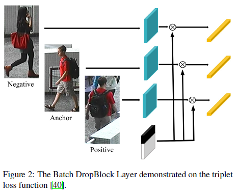
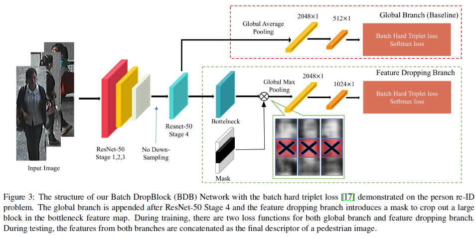
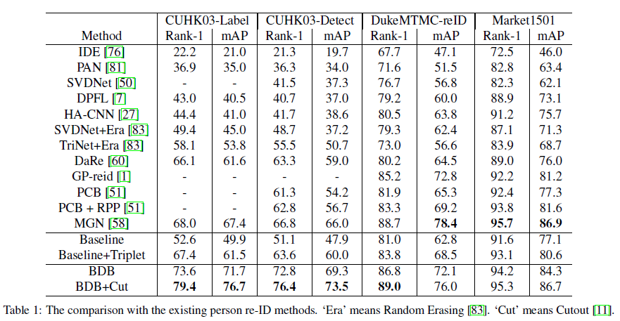

# Batch DropBlock Network for Person Re-identification and Beyond

作者：Zuozhuo Dai, Mingqiang Chen, Xiaodong Gu, Siyu Zhu, Ping Tan

## 摘要

本文提出Batch DropBlock(BDB) Network，其使用两个分支，一个分支学习全局特征，一个分支对batch中的图片擦除同一块学习局部特征。最后使用triplet+softmax作为loss函数。在CUHK03-Detect数据集达到了76.4%的rank1。

## 简介

由于行人身体部件如脸部、手部和脚在不同视角下都不稳定，CNN倾向于聚焦于整个身体部分，为了解决这个问题，很多工作使用局部特征对齐进行学习或使用注意力选择网络提高特征学习。在本文中提出了用于大致对齐的度量学习任务的Batch DropBlock网络（BDB网络），BDB有两个分支，一个学习全局特征，一个随机去掉所有特征图的同一块区域，然后将两个特征联合起来。

Batch DropBlock与DropBlock的不同在于：

（1）BDB是一个针对度量学习的特征学习模块，而DropBlock是一个针对分类任务的正则化方法。

（2）BDB在一个batch中丢弃同一区域，DropBlock却随机擦除不同图片

## Bathch DropBlock (BDB) Network

### Backbone Network

骨干网络使用ResNEt50，去掉降采样层得到2048*24*8的特征图

### ResNet50 Baseline

全局特征提取分支中，在ResNet50的第4 stage后，用全局平局池化得到2048维的特征，然后使用conv1*1降维到512，后接一个ReLU层。

### Batch DropBlock Layer

对输入的张量T，Batch DropBlock Layer随机将同一区域的值改为0，tripletloss中的BDB层如Fig2

### Network架构

如Fig3所示

全局分支通常用于在多分支网络体系结构中提供全局特征表示。 它还监督feature frop分支的训练，并使Batch DropBlock图层应用在经过充分了解的特征图上。 为了证明这一点，在Fig4中可视化了在有和没有全局分支的情况下训练的下降分支的类激活图。 可以看到，仅通过分支分支获得的特征在空间上更加分散，并带有多余的背景噪声（例如在图4（c）的底部）。

特征删除分支的目的是学习多个注意特征区域，而不是只关注主要的区分区域。 Fig4还可视化了具有DropBlock或Batch DropBlock的功能下降分支的类激活图。 可以看到DropBlock学习的功能缺少某些细心的零件功能（例如，图Fig4（d）中的支腿），并且Batch DropBlock的显着表示具有更准确，更清晰的轮廓。 直观的解释是，通过阻止相同的大致对齐区域，我们通过语义对应来增强其余部分的细心特征学习。

在测试期间，将来自全局分支和特征删除分支的特征串联起来，作为行人图像的嵌入向量。 在此，以下三点值得注意。 1）Batch DropBlock层没有参数，不会增加网络大小。 2）批处理DropBlock层可以轻松地用于除人员重新ID之外的其他度量学习任务中。 3）Batch DropBlock超参数是可调的，无需为不同任务更改网络结构。

## 实验

