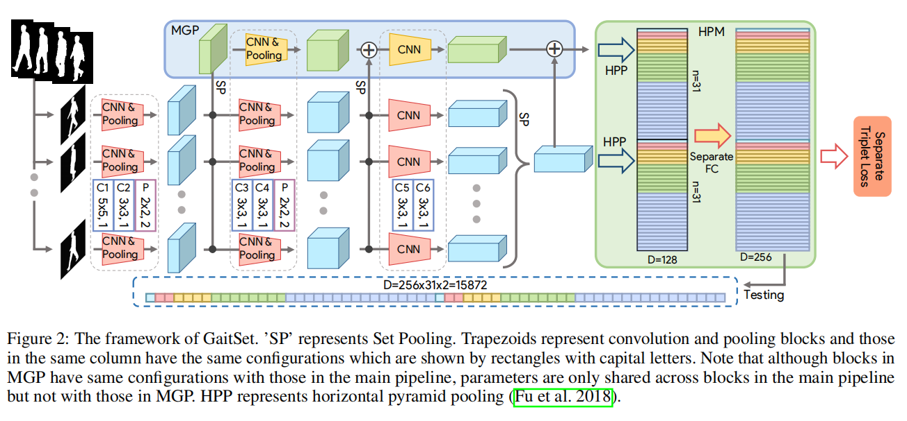
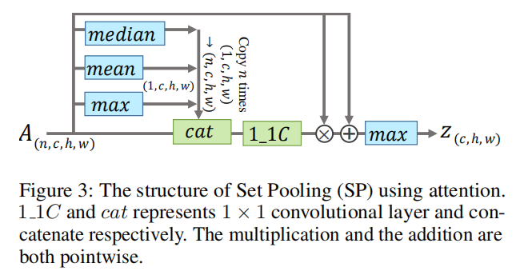
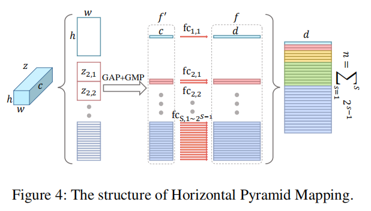

# GaitSet Regarding Gait as a Set for Cross-View Gait Recognition

## 摘要

现有的步态识别方法要么利用难以保留时间信息的步态模板，要么利用步态序列，后者必须保留不必要的顺序约束，从而失去了步态识别的灵活性步态研究中，时间序列信息是比较难描述的，

## 正文

### 介绍

文章提出了GaitSet这个网络，基于集合的思想，该网络不受帧排序的影响。

原本的步态模板方法简单易行，但容易丢失时间和细粒度的空间信息；近年很多直接从原始的步态轮廓序列中提取特征。但是，这些方法易受外部因素的影响。 此外，比起使用单个模板（如步态能量图像（GEI））的网络，像3D-CNN这样的用于提取顺序信息的深度神经网络更难训练。

文章使用GaitSet方法将一个集合的人体轮廓图送入网络，首先，使用CNN分别从每个轮廓提取帧级特征。其次，用称为集池化（Set Pooling）的操作用于将帧级特征聚合为单个集级特征。由于此操作是应用于高级特征图而不是原始轮廓，因此与步态模板相比，它可以更好地保留空间和时间信息。

### GaitSet

一个N人数据集，每个人为$y_i$，$i\in 1,2,...,N$，某个人的剪影序列只与id号有关，记为$P_i$。一个人的一个或多个序列中的所有剪影都可以视为一组n个剪影$X_i = \{x_i^j|j=1,2,...n\}$，$x_i^j \in P_i$，步态识别以以下公式表示：
$$f_i = H(G(F(X_i)))$$

其中F为用于提取帧级别的特征的卷积网络；G是置换不变函数，用集合池化(Set Pooling)实现，用于将一组帧级特征映射到集合级特征；H于从集合水平特征中学习$P_i$的判别式，用水平金字塔(Horizontal Pyramid Mappint, HMP)来实现；输入的$X_i$是一个4维张量(set dimension，image channel dimension，image hight dimension，image width dimension)

#### Set Pooling

集合池化整合一个集合的步态信息，$z = G(V)$，其中z表示集合级别特征，而$V = \{v^j|j=1,2,...,n\}$表示帧级别特征。这个操作有两个约束，(1)是将集合作为输入，它应该是一个排列不变函数，其表达为：$G(\{v^j|j=1,2,...,n\}) = G(\{v^{\pi(j)}|j=1,2,...,n\})$，其中$\pi$为一个排列；(2)由于在现实生活中，一个人的步态剪影的数量可以是任意的，因此函数G应该可以处理具有任意基数的集合。

使用attention机制来利用全局信息为每个帧级特征图学习逐个元素的attention图，以对其进行细化。

将特征图分割成条带通常用于人员重新识别任务，图像被裁剪并根据行人的大小调整为统一大小，而区别部分随图像的不同而不同。文章将水平金字塔池化(Horizontal Pyramid Pooling, HPP)最后池化后面的$1*1$卷积层用全连接层替代，对每个合并要素使用独立的完全连接层（FC），以将其映射到区分性空间，这个方法被称为水平金字塔映射(Horizontal Pyramid Mapping, HPM)

HPM有S个刻度，在$s \in 1,2,...,S$，SP提取出的特征图在height维度被划分为$2^{s-1}$个条带，一共有$\sum_{s=1}^S 2^{s-1}$个条带。然后一个Global Pooling作用于3-D的条带提取1-D的特征。对于一个条带$z_{s,t}$，其中$t \in 1,2,...,2^{s-1}$表示条带在刻度中的索引，Global Pooling的方程为：$f'_{s,t} = maxpool(z_{s,t})+avgpool(z_{s,t})$，其中$maxpool$是Global Max Poling，$avgpool$是Global Average Pooling。最后一步是用FCs来将特征$f'$映射到一个可描述的空间，每一种条带使用一种全连接。

卷积网络的不同层具有不同的接收场。 层越深，接收场将越大。 因此，浅层特征图中的像素集中在局部和细粒度的信息上，而较深层特征图中的像素集中在更全局和粗粒度的信息上。 通过在不同层上应用SP提取的集合级别特征具有类比属性，为了收集各种级别的集合信息，提出了多层全局管道（MGP）。 它具有与主管道中的卷积网络类似的结构，并且将在不同层中提取的集级别特征添加到MGP。 由MGP生成的最终特征图也将由HPM映射到$\sum_{s=1}^S s^{s-1}$特征中。

最后的损失函数使用的是triplet loss

算法实验结果如下：
