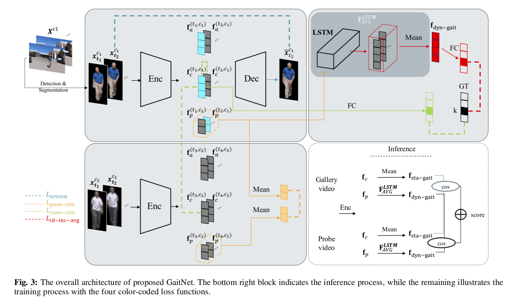
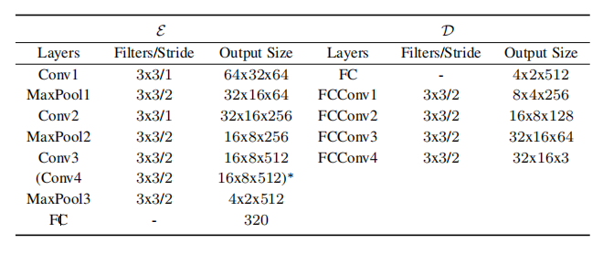

# On Learning Disentangled Representations for Gait Recognition Notes
### author:Ziyuan Zhang, Luan Tran, Feng Liu, Member, IEEE, and Xiaoming Liu, Member, IEEE

### 摘要：
当前主要步态识别方法采用人形剪影或者链接类型的人体模型作为步态特征。当面临着装、携带物品或者角度的变化效果步态理想。本文提出了一种自动编码的框架GaitNet来从RGB图像中分隔出外观特征、典范特征（类似于GEI的静态特征）以及姿态特征（使用LSTM，作为动态特征）。同时，文章结合扫了Frontal-View Gait(FVG)这个关注于正面的数据集。

### 正文

符号列表

算法结构

文章做了特征分解以解决之前提出的一系列问题。

**pose feature**：外观特征描述对象的衣服

**appereance feature**：姿势特征描述了身体部位的位置，其随时间的动态变化是步态的核心要素

**canonical feature**：描述身材的特征（矩形，三角形，倒三角形和沙漏形身材），手臂长度、躯干vs腿长的比例等

#### 算法流程

输入GaitNet的是一段视频序列，使用目标检测与分割算法（文中使用Mask R-CNN）提取人物，设计三种损失函数，编码后的数据用于区分pose,canonical,appearance

##### 特征分解

编码算法E：$f_a,f_c,f_p = E(x)$

解码算法D：$\hat{x}=D(f_a,f_c,f_p)$

编码解码算法使用的CNN

**交叉重建损失(Cross Reconstruction Loss)**：$\hat{x}$与原始输入的x接近。文章的cross reconstruction loss使用帧$t_1$的appearance特征$f_a$$^{t_1}$和canonocal特征$f_c$$^{t_1}$以及帧$t_2$的姿势特$f_p$$^{t_2}$,$$L_{xrecon} = ||D(f_a^{t_1}，f_c^{t_1}，f_p^{t_2})-x^{t_2}||$$

**姿势相似度损失(Pose Similarity Loss)**：类似于GEI，同一个人的两段视频$c_1$长$n_1$，$c_2$长$n_2$,$$L_{pose-sim} = ||\frac{1}{n_1}\sum_{t=1}^{n_1}f_p^{(t,c_2)}||_2^2$$

**规范一致性损失(Canonical Consistency Loss)**：$$L_{cano-cons} = \frac{1}{n_1^2} \sum _{i \neq j}||f_c^{(t_i,c_1)}-f_c^{(t_j,c_1)}||_2^2+\frac{1}{n_1}\sum_i||f_c^{(t_i,c_1)}-f_c^{(t_j,c_2)}||_2^2+\frac{1}{n_1}\sum_i -log(C_k^{sg}(f_c^{(t_1, c_1)}))$$

#### 步态特征学习与聚合
##### 通过canonical特征聚合得到静态步态特征
$$f_{sta-gait} = \frac{1}{n}\sum_{t=1}^nf_c^t$$

##### 通过聚合pose特征获得动态步态特征

使用LSTM探索pose特征的时间信息，比如：受试者身体部位的轨迹如何随时间变化

LSTM的输出送到了一个$C^{dg}$分类器中（文中使用线性分类器）

设$h^t$为LSTM在时间t的输出$$h^t = LSTM(f_p^1,f_p^2,...,f_p^t)$$

一个简单的识别方法是在最终时间步骤的LSTM输出之上添加分类损失

$$L_{id-single} = -log(C_k^{dg}(h^n))$$

**使用平均特征进行识别（Identification with Averaged Feature）**

为了减少最后一个时间数据对LSTM输出的影响，文中使用平均的LASTM输出作为步态特征来识别
$$f_{dyn-gait}^t = \frac{1}{t}\sum_{s=1}^th^s$$
识别损失函数为：
$$L_{id-avg} = -log(C_k^{dg}(f_{dyn-gait}^n)) = -log(C_k^{dg})(\frac{1}{n}\sum_{s=1}^nh^s)$$

**增量身份损失函数（Incremental Identity Loss）**
预计LSTM会了解到，视频序列越长，它处理的步行信息越多，因此可以更加有效地识别出对象。 文中使用每个时间步的所有中间输出（按$w_t=t^2$)加权）：
$$L_{id-inc-avg} = \frac{1}{\sum_{t=1}^nw_t}\sum_{t=1}^n-w_tlog(C_k^{dg}(\frac{1}{t}\sum_{s=1}^th^s))$$

**最终的损失函数**：$$L = L_{id-inc-avg}+\lambda_rL_{xrecon}+\lambda_dL_{pose-sim}+\lambda_sL_{cano-sim}$$

### 模型推论
g代表图库（gallery），p代表需探测目标（probe）
$$Score = (1-\alpha)*cos(f_{sta-gait}^g,f_{sta-gait}^p)+\alpha*cos(f_{dyn-gait}^g,f_{dyn-gait}^p)$$

### 结论
