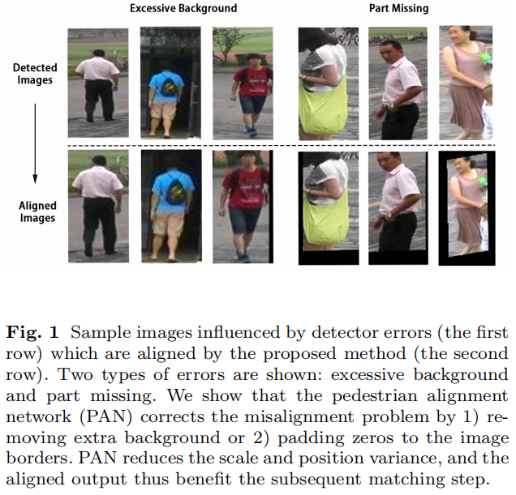
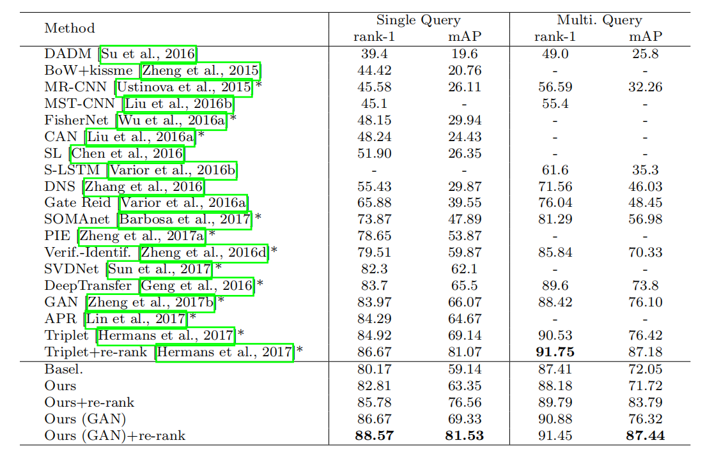

# Pedestrian Alignment Network for Large-scale Person Re-identification

## 摘要

Re-ID被划分为图像检索问题，主要存在两个挑战：1、复杂背景；2、局部缺失。这两个误差都会破坏行人对准的质量，并可能由于位置和比例差异而降低行人匹配准确率。对准也是可以学习的，本文提出一种行人对准网络（PAN），网络可进行有区别的嵌入学习，而无需额外的标注。

## 正文

### 简介

PAN中，给定检测到行人的图像，该网络同时学习重新定位该人并将该人归类为预定义的身份。 因此，PAN利用了人员对齐和重新识别的互补性。

该算法有以下步骤：

（1）一个预测输入图片id的网络

（2）一个重新框取人物的方法

（3）另一个根据输入图片预测id的网络

（1）和（3）共享低层次的特这个，在测试的时候联结起来用全连接层来构建行人的特征描述符。（2）中的精炼参数由高层次的特征图来估计。这一步构建了一个不一样的局部网络：空间转换网络(spatial transformer network, STN)

本文的方法解决了由检测错误引起的未对准问题，而常用的色块匹配策略旨在在良好对准的图像中发现匹配的局部结构

### 相关研究

#### 手工特征Re-ID系统

之前的比较鲁棒的手工特征有：LBP、Gabor、LOMO。

还有一系列的工作围绕这32-D LAB颜色值房图和128-D SIFT算子。

除了手工寻找特征，矩阵学习也很多，如KISSME是基于马氏距离的且将对比较表述为对数似然比检验的方法。然后扩展了贝叶斯和KISSME以学习具有度量的判别子空间。

还有的就是一组弱RankSVMs来组成一个强排序器。有用AdaBoost算法来将不同的特征归结到单一相似度的方法。

#### 基于深度学习的方法

将行人图片水平划分为三块，然后训练三个part-CNN来获取特征。

类似的，将卷集图分为四块将局部特征与全局特征结合。

一种基于注意力的软模型，以关注零件并将CNN与LSTM零件选择性地结合在一起； 它的局限性还包括计算效率低下。

2016年郑哲东提出提出将识别模型与验证模型相结合，并改善微调的CNN性能。

#### 对象对准

很多工作都是针对注意力模型来进行目标定位的。

还有STN网络来精炼鸟类识别和房屋树木识别。

结合faster-RCNN，RNN和STN可以进行图片目标捕获。

#### Pedestrain Alignment Network（行人提取网络，PAN）

网络使用ResNet-50作为基准模型，每个block包括conv+batchnorm+ReLU+maxpooling，每个bloak后特征图降维到边长为原来一半。

##### 基础分支和对准分支

模型中由两个主要的conv分支，每个都是用于预测id值的分类网络。给一个原始的检测图像，base分支不仅学习如何辨别id，同时对图像的外观进行编码。对准分支使用一个类似的网络，但是处理由仿射估计分支生成的对齐特征图。

对准分支使用三个ResBlocks和一个average pooling layer，最后使用FC层进行分类预测。两个分支不共享参数。

使用$W_1,W_2$表示两个conv分支的参数。输入一张图片$x$，使用$p(k|x)$来表示$x$是第$k \in \{1 \dots K\}$类。特别的$p(k|x)=\frac{exp(z_k)}{\sum^K_{k=1}exp(z_i)}$。其中$z_i$是从CNN模型中输出的配额能行

对这两个分支，cross-entropy loss如下：

$$l_{base}(W_1,x,y) = -\sum^K_{k=1}(log(p(k|x))q(k|x))$$

$$l_{align}(W_2,x,y) = -\sum^K_{k=1}(log(p(k|x_a))q(k|x_a))$$

其中$x_a$是aligned的输入，给一个label $y$，对于所有$k \neq y$的真实分布$q(y|x)=1$且$q(k|x)=0$。代入上面的式子得到：

$$l_{base}(W_1,x,y) = -log(p(y|x))$$

$$l_{align}(W2,x_a,y) = -log(p(y|x_a))$$

##### 仿射估算分支

从ResNet截出Res2和Res4，affine branch包括一个双线性插值采样和网格网络，Grid Network包括一个ResBlock和一个avgpooling。Res4通过Grid Network来回归到一个6维的转换参数。这个学习到的转换参数$\theta$用于表示图片网格。

$$\begin{pmatrix}x_i^s\\\\y_i^s\end{pmatrix} = \begin{bmatrix}\theta_{11} & \theta_{12} & \theta_{13}\\\\\theta_{21} & \theta_{22} & \theta_{23}\end{bmatrix}\begin{pmatrix}x_i^t\\\\y_i^t\\\\1\end{pmatrix}$$

其中$(x_i^t,y_i^t)$是输出要素图上的目标坐标，$(x_i^s,y_i^s)$是输出要素图上源的坐标。$\theta_{11},\theta_{12},\theta_{21},\theta_{22}$处理规模和旋转变换。$\theta_{13},\theta_{23}$处理平移。

$$U_{(m,n)}^c = \sum_{x^s}^H \sum_{y^s}^WV_{(x^s,y^s)}^Cmax(0,1-|x^t-m|)max(0,1-|y^t-n|)$$

$U^c_{(m,n)}$是输出特征图(m,n)处在c通道的值，$V^C_{(x^s,y^s)}$是输入特征图在$(x_s,y_s)$处c通道的值。

##### 行人描述符

$$f_i = [\alpha |f_i^1| ^T,(1-\alpha)|f_i^2|^T]^T$$

##### Re-ranking 重排列

首先通过将画廊图像的欧几里德距离排序到查询中来获得等级列表$N(q,n)=[x_1,x_2, \dots, sx_n]$。

文章还考虑了Jaccard similarity。k个倒数最近的邻居$R(p,k)$由出现在查询p的前k个检索排名中的元素组成，而查询也位于元素的前k个排名中。

$$R(p,k) = \{x|x \in N(p,k),p \in N(x,k)\}$$

将$R$拓展到$R^*$来给出更多的正样本，Jaccard similarity即为：
$$D_{similarity} = 1- \frac {|R^*(q,k) \bigcap R^*(x_i,k)|} {|R^*(q,k) \bigcup R^*(x_i,k)|}$$

