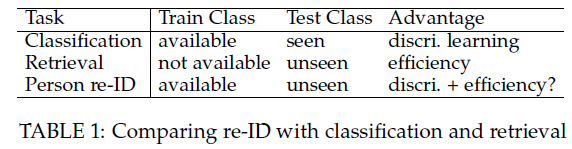
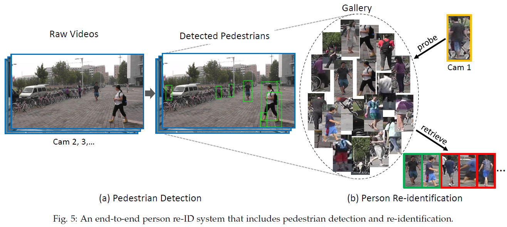
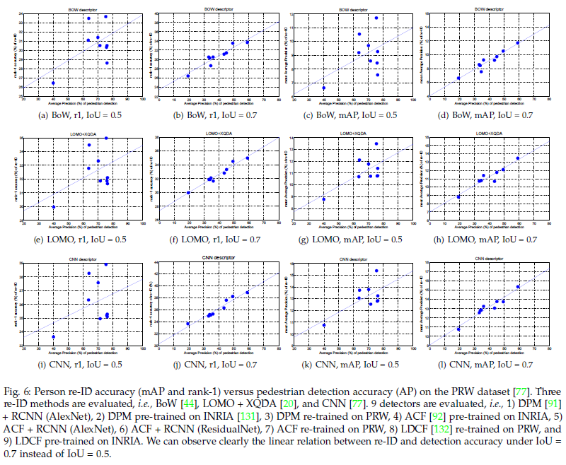
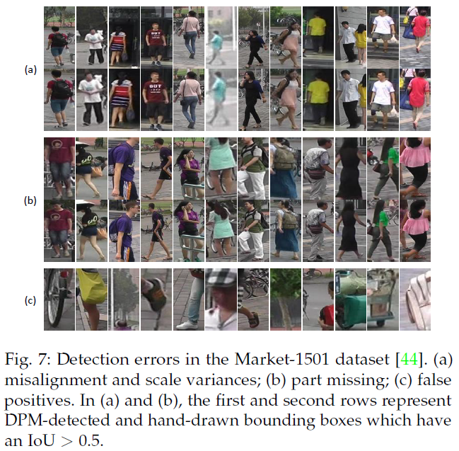
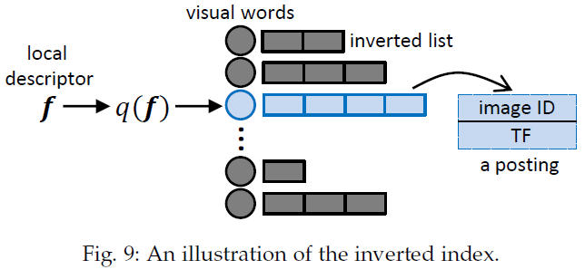

# Person Re-identification Past Present and Future

作者：Liang Zheng, Yi Yang, and Alexander G. Hauptmann
[TOC]
## 摘要

ReID早期主要针对手工特征算法和小数据集，现在的大数据集和深度学习方法的涌现对ReID有极大促进。本文将ReID分为基于图像和基于视频两类。手工特征和深度学习方法都被回顾。两个新的ReID任务：端对端ReID以及针对大量查询数据的快速ReID。

## 简介

ReID定义：重新标识一个特定的事物，就是要将其标识为与上一次遇到的特定事物相同。

Person ReID的定义也类似，在视频中要找到一个特定的人是否在另一个摄像头中出现过。这个任务主要源于：（1）公共安全（2）摄像头网络越来越大。

视频监视中的实际人员重新识别系统可以分为三个模块，即人员检测，人员跟踪和人员检索。大多数re-ID工作都集中在最后一个人员检索上。从计算机视觉的角度来看，re-ID中最具挑战性的问题是如何在强烈的外观变化（例如灯光，姿势和视点）下正确匹配同一个人的两个图像。Fig1是当前ReID论文发表的情况

### 综述的组织

本篇综述主要针对视觉部分，同时本文聚焦ReID当前已有的或可能出现的不同的子任务。

本文首先介绍ReID的历史（Section1.2），还有与分类和查找问题的关系（Section1.3）。然后描述基于图像和基于视频的ReID（Section2、Section3，均介绍了手工特征和深度学习的方法）。Section4介绍检测、跟踪和ReID的关系。Section5介绍STOA的模型，其他的问题在Section6中进行总结。Section7是最后总结。

### Person ReID的简史

Fig2描述了ReID的里程碑

#### 多摄像头跟踪

在1997年，Huang和Russell[9]提出了一种贝叶斯公式来估计在预测其他摄像机视角观察到的特征的情况下对一台摄像机进行预测的后验概率

#### 具有明确“重新识别”的多摄像机跟踪

假设每个人都有一个唯一的潜在标签，并且定义了一个动态贝叶斯网络来编码小轨道中标签与特征（颜色和时空提示）之间的概率关系

#### re-ID的独立性（基于图像）

基于颜色和显着的角度直方图的视觉匹配是由铰接的行人模型或Hessian-Affine兴趣点算子执行的。

#### 基于视频的ReID

Bazzani等，进一步将Bhattacharyya距离用于颜色和一般缩影特征

#### ReID的深度学习

使用暹罗神经网络[17]确定一对输入图像是否属于同一ID

#### 基于图片的端对端ReID

综合检测和ReID可以提高准确率

### ReID与分类和查找问题的关系

根据训练和测试类别之间的关系，person re-ID位于图像分类[14]和实例检索[19]之间（Table1）

## 基于图像的Person ReID

封闭ReID，$G$是一个含有$N$个人的图片查询库，定义为${g_i}^N_{i=1}$，给定一个查询图片$q$，它的id为：

$i^* = argmax_{i\in1,2...,N}sim(q,g_i)$

其中$i^*$是$q$的id，$sim(.,.)$是一个相似评估函数

### 手工特征系统

#### 行人描述符

最常用的特征就是颜色，纹理特征提及比较少。

根据身体构造，计算加权的颜色直方图（WH），最大稳定的颜色区域（MSCR）和循环的高结构色块（RHSP）。

Gheissari等[11]提出了一种时空分割方法来检测稳定的前景区域。 对于局部区域，计算HS直方图和edgel直方图。

Gray和Tao[24]在亮度通道上使用8个颜色通道（RGB，HS和YCbCr）和21个纹理滤镜，行人被划分为水平条纹。

Mignon等[28]从RGB，YUV和HSV通道以及水平条纹中的LBP纹理直方图构建特征向量。

在赵等人的一系列作品中[30][33][34]32维LAB颜色直方图和128维SIFT描述符是从每个10 * 10色块中以5个像素的步长进行密集采样而提取的[35]中也使用了此方法。

Das等[36]从[12]中提出的轮廓将HSV直方图应用于头部，躯干和腿部。

Li等[31]还从补丁中提取局部颜色描述符，但使用分层高斯化[37]聚合它们以捕获空间信息，随后是[38]。

Pedagadi等[39]在使用PCA进行降维之前，先从HSV和YUV空间提取颜色直方图和矩。

刘等[40]提取每个局部补丁的HSV直方图，梯度直方图和LBP直方图。

为了提高RGB值对光度变化的鲁棒性，Yang等人[41]介绍了基于显着颜色名称的颜色描述符（SCNCD），用于全局行人颜色描述。

在[20]中廖等人。 提出局部最大出现（LOMO）描述符，其中包括颜色和SILTP直方图。

在[44]中Zheng等。 建议提取每个局部色块的11维颜色名称描述符[45]，然后通过词袋（BoW）模型将它们聚合为全局矢量。

[46]提出了一种分层的高斯特征来描述颜色和纹理提示，该特征通过多个高斯分布对每个区域进行建模

相较于使用低层颜色和纹理特征，另一个好的选择是基于中层属性特征的方法。

在[47]中Layne等人在VIPeR数据集上注释15个与着装和软生物特征有关的二进制属性。 低级颜色和纹理功能用于训练属性分类器。 经过属性加权后，结果向量将集成到SDALF[13]框架中以与其他视觉特征融合。

刘等[48]使用带注释的属性改进了潜在的Dirichlet分配（LDA）模型，以过滤出嘈杂的LDA主题。

在[50]中，Su等人将同一个人但不同摄像机的二进制语义属性嵌入到连续的低秩属性空间中，从而使属性向量更具匹配性。

#### 距离矩阵学习

度量学习方法分为有监督学习与无监督学习，全局学习与局部学习等。

最常用的公式是基于马氏距离函数的类别，该函数使用线性缩放和特征空间的旋转来概括欧氏距离，特征$s_i,x_j$的距离写作：

$d(x_i,x_j) = (x_i-x_j)^TM(x_i,x_j)$ 

其中$M$是一个半正定矩阵。

当前ReID最常用的矩阵学习方式KISSME基于以上公式。

在[55]中，将对（i，j）是否相似的判断制定为似然比检验。采用成对的差$(x_{i,j} = x_i-x_j)$，并且差空间假定为均值为零的高斯分布。

在[55]中表明，马氏距离度量可以自然地从对数似然比检验得出，并且在实践中，将主成分分析（PCA）应用于数据点以消除尺寸相关性

温伯格等[56]提出了一种大余量最近邻居学习（LMNN）方法，该方法为目标邻居（匹配对）设置了一个边界，并惩罚了那些入侵该边界的人（冒名顶替者）。

为了避免在LMNN中遇到过度拟合的问题，Davis等人[57]提出信息理论度量学习（ITML）作为满足给定相似性约束和确保学习的度量接近初始距离函数之间的权衡。

Chen等[38]除了马氏距离之外，还添加了双线性相似度，因此可以对跨补丁相似度进行建模

在[31]中，全局距离度量与本地自适应阈值规则耦合，该规则还包含$(x_i,x_j)$的正交信息

在[59]中，廖等人建议保留正定约束，并建议对正样本和负样本进行加权。

除了学习距离度量之外，有些作品还专注于学习判别子空间。廖等[20]提出了学习投影到低维子空间的方法，并采用与线性判别分析（LDA）类似的方式解决了交叉数据。

$J(w) = \frac{w^TS_bw}{w^TS_ww}$

$S_b,S_w$是类间与类内的判别矩阵。

要学习w，Zhang等[42]进一步利用零值弗利·萨蒙（Foley-Sammon）变换来学习判别零值空间，该零值空间满足零级内散布和正级间散布。

在[28]中，提出了成对约束成分分析（PCCA），它学习了线性映射功能，能够直接对高维数据进行处理，而ITML和KISSME需要在之前进行降维步骤。

在[62]中熊等人进一步提出了两种现有子空间投影方法的改进版本，即正则化PCCA[28]和内核LFDA [39]。

除了使用马氏距离（等式2）的方法外，有些还使用其他学习工具，例如支持向量机（SVM）或Boosting。

Prosser等[25]建议学习一组弱的RankSVM，随后将其组装成一个更强的ranker

在[63]中采用结构化SVM在决策级别组合不同的颜色描述符。 

在[43]中，Zhang等为每种训练身份学习特定的SVM，并将每个测试图像映射到根据其视觉特征推断出的权重向量。 

Gray和Tao [24]提出使用AdaBoost算法来选择并将多种不同的简单特征组合到一个相似性函数中。

### 深度学习系统

ReID中主要的两类CNN模型是（1）用在图像分类和目标检测的分类模型，（2）是使用图像对[65]或三元组[66]作为输入的暹罗模型。

ReID中主要的瓶颈在于缺少训练数据，所以当前的ReID大部分关注于暹罗模型。

在[15]中，将输入图像划分为三个重叠的水平部分，这些部分经过两个卷积层以及一个完全连接的层，该层将它们融合并为该图像输出特征矢量。使用cos距离判别两张图片的相似度。

Li等人设计的体系结构[16]的不同之处在于，添加了一个块匹配层，该层使两个水平条纹中的图像的卷积响应相乘，本质上类似于ACS[30]。

艾哈迈德等[69]通过计算交叉输入邻域差异特征改进了暹罗模型，该特征将一个输入图像的特征与另一图像的相邻位置的特征进行了比较。

Wu等[70]使用较小规模的卷积滤波器（称为“ PersonNet”）加深了网络。

在[71]中，Varior等人。 将长短期记忆（LSTM）模块整合到暹罗网络中。LSTM顺序处理图像部分，以便可以记忆空间联系以增强深层特征的判别能力。

Varior等[72]提议在每个卷积层之后插入一个选通函数，以在将一对测试图像馈入网络时捕获有效的细微图案。

类似于[72]刘等[73]提出将基于软注意力的模型集成到暹罗网络中，以自适应地关注输入图像对的重要局部。 但是，这种方法也受到计算效率低下的限制。

Cheng等人[74]设计一个三重态损失函数(triplet loss)，将三个图像作为输入

其他可能有效的策略是使用分类/识别模式，这样将会使用所有的ReID label。

在[76]中，来自多个数据集的训练身份共同形成训练集，并且在分类网络中采用了softmax损失。

在[79]中，包括SIFT和颜色直方图在内的低级描述符被聚合到每个图像的单个Fisher Vector[80]中。混合网络在输入的Fisher向量上构建完全连接的层，并强制执行线性判别分析（LDA）作为目标函数，以产生具有低类内方差和高类间方差的嵌入。

Wu等[81]提出将FC特征和一个低级特征向量串联起来，在softmax损失层之前是另一个FC层。

### 数据集和评估

#### 数据集

#### 评估矩阵

在评估re-ID算法时，通常使用累积匹配特性（cmc）曲线。无论gallery中有多少实况匹配项，CMC计算中都只计算第一个匹配项。

完美的re-ID系统应该能够将所有真实匹配项返回给用户，为了研究的完整性，当gallery中存在多个基本事实时，Zheng等人[44]提出使用平均平均精度（mAP）进行评估。

#### 当前ReID准确率

## 基于视频的Person ReID

随着数据量的增加，基于视频的ReID也兴起了。与边界框功能一样重要，基于视频的方法更加关注多镜头匹配方案和时间信息的集成。

### 手工特征系统

在[86]中，基于一组协方差特征，使用多次射击来训练判别式提升模型。

在[99]中，SURF局部特征用于检测和描述短视频序列中的兴趣点，这些兴趣点又在KD树中被索引以加快匹配速度

在[11]中，生成时空图以识别用于前景分割的时空稳定区域。

Cong等[100]利用视频序列中的流形几何结构来构建具有基于颜色特征的更紧凑的空间描述符。

Karanam等[103]利用一个人的多镜头，并提出探针特征应以画廊中同一个人的线性组合的形式呈现。 身份的多次拍摄也可以用来增强身体部位的对齐方式。

在[85]中，为了寻找精确的零件间对应关系，Cheng等人提出了一种迭代算法，其中由于零件检测器的改进，图形结构的拟合在每次迭代后变得更加准确。

在[104]中，估计行人姿势，并以更高的置信度匹配具有相同姿势的帧。

**上述方法通常基于多个镜头来构建外观模型，并且最近的趋势是将时间线索纳入模型中**

Wang等[105]提出使用时空描述符来重新识别行人。它的方法包括HOG3D[106]和步态能量图像（GEI）[107]。

在[108]中，Liu等人提出将视频序列分解为代表与某些动作原语相对应的身体动作的一系列单元，从中提取费舍尔向量以用于人的最终表示。

高[109]利用行人的周期性属性，将步行周期划分为几个段，这些段由时间对齐的池描述。

在[111]中，提出了一种集合验证方法，其中采用传输排名来判断查询是否与属于同一身份的图像之一匹配。

在[89]中提出的局部匹配模型的多重扩展使最佳匹配对的距离最小，并减少了交叉视图变换的次数。

在[112]中，Zhu等人提议同时学习视频内和视频间距离度量，以使视频表示更加紧凑并区分不同身份的视频。

You等[113]提出了一种顶推式距离学习方法，该方法通过选择判别特征来优化视频re-ID中的顶级匹配。

### 深度学习系统

当前基于视频的ReID基本都包括了池化步骤，（max/avg pool）或者使用全连接层进行学习。

在Zheng等人的系统中[21]，时间信息没有被明确地捕获。相反，将身份框架视为其训练样本，以训练具有softmax损失的分类CNN模型。

徐等[116]建议在直接CNN特征转移中，将CaffeNet的第5卷积层中的列特征聚合为Fisher向量[80]或VLAD [117]。

费尔南多等[118]提出了一种等级学习模型，以捕获视频中帧特征如何随时间演变，从而产生视频范围内时间动态的视频描述符。

Wang等[119]将多层编码层嵌入CNN模型中，并产生序列长度不同的视频描述符。

也就是说，注意[114]，[115]，[120]，其中外观特征（例如CNN，颜色和LBP）被用作输入RNN网络的起点 捕捉帧之间的时间流。

### 数据集和评估

存在若干个多镜头re-ID数据集，例如ETH[122]，3DPES[123]，PRID-2011[86]，iLIDS-VID[105]和MARS[21]。

ETHZ数据集是一单个可移动摄像头捕获的数据，包括三个序列和各序列的复杂图片，该数据集相对容易，并且多镜头场景的re-ID准确性接近100％[124]

3DPeS数据集包括8个不重叠的室外摄像头书记，该数据集主要用于单镜头ReID。

PRID-2011和iLIDS-VID很相似，都是2个摄像头获取每个id2段视频，iLIDS-VID有300个id，视频都是室内获取的。PRID-2011有385/749个室外获取的id，200个id出现在两个摄像头中。测试使用178个id【105】.

MARS数据集包括1261个id,20000个视频序列，使用DPM检测器和GMMCP跟踪获取Fig4展示了再这些数据集上的SOTA水平。

## 未来：检测，跟踪和行人重识别

### 前序工作

当前的ReID工作大多基于两个前提：（1）gallery中行人的bounding boxes是给出的（2）bounding boxes是手工标注的且质量很好。但在实际操作中，这两个假设不一定有。当检测召回率/精度由于不同的阈值而发生变化时，re-ID准确性不会保持稳定。当使用行人检测器时，边界框通常会存在检测错误，例如未对准，未检测到和错误警报。当使用行人跟踪器时，跟踪错误可能会导致小轨迹内的异常帧，即背景或具有不同身份的行人。所以行人检测和跟踪的质量对ReID的准确率有直接影响。

Xu等人提出了有关端到端人员re-ID的第一项工作[18]（2014年）。他们使用“通用性”一词来描述图像边界框如何类似于行人，而使用“唯一性”来表示画廊边界框与查询之间的相似性。

2016年，Xiao等[128]和Zheng等[77]同时引入了基于大规模数据集的端到端re-ID系统，这两幅作品均以原始视频帧和一个查询边界框作为输入（Fig5）。

在具有相同的re-ID功能集的情况下，更好的行人检测器往往会产生更高的re-ID准确性。[77]，[128]中，对人通常在野外（PRW）和大规模人员搜索（LSPS）数据集中进行识别，并且通常使用此论点。

在[18]，[77]中，检测置信度被整合到最终的re-ID分数中。 在[128]中，在类似于R-CNN的CNN模型中[129]共同考虑了行人检测和re-ID，而在[77]中，当被微调时，ID区分嵌入（IDE）被证明是更好的- 根据在R-CNN模型[130]上预先训练的CNN模型进行调整，以进行行人检测。 这些方法提供了关于标记较弱的检测数据如何帮助提高re-ID准确性的初步见解。

ReID呗视为检测，跟踪和检索集成到一个框架中，并评估每个模块对整体re-ID性能的影响的“最终”目标。 因此，此要求提供可用于这三个任务的边界框注释的大规模数据集。

### 未来的问题

#### 系统性能检测

评估协议应该能够以一种真实，无偏见的方式对检测器/跟踪器的性能进行量化和排名，并提供有关re-ID准确性的信息。

**首先，对于行人检测和re-ID跟踪使用有效的评估指标至关重要**

行人检测大多采用对数平均未命中率（MR），该对数未命中率是在$[10^{-2},10^0]$FPPI（每个图像误报）。有些人还遵循PASCAL VOC[134]中的例程使用平均精度（AP）。

AP/MR计算中的一个重要参数是联合相交（IoU）分数。 如果检测到的边界框与地面真值边界框的IoU分数大于阈值，则认为该边界框正确。

KITTI基准[137]要求汽车检测的IoU为0.7，而行人的IoU为0.5。

Fig6展示了PRW数据集上检测精度（AP）和ReID精度（等级1或mAP）之间的关系。

在多对象跟踪（MOT）基准[139]中，使用了多个评估指标，包括多对象跟踪精度（MOTP）[140]，主要是跟踪（MT）目标（其轨迹被跟踪覆盖的地面真人的百分比 至少80％的结果），假阳性总数（FP），ID开关总数（IDS），轨迹被分段的总数（Frag），每秒处理的帧数（Hz） ）等。

**评估程序的第二个问题涉及整个系统的re-ID准确性**

由于此任务不需要非常精确地定位人员，因此我们可以使用宽松的检测器/建议或跟踪器，以提高帧级召回率。 可以学习检测器/提议，以定位具有宽松IoU限制的行人的粗糙区域，并更加注重匹配，即从较大的边界框/时空管中找到特定的人。

#### 检测/跟踪对于ReID的影响

首先，行人/跟踪错误确实会影响re-ID的准确性，但是其内在机制和可行解决方案仍然面临挑战。

检测错误（Fig7）可能会导致行人错位，比例尺变化，零件丢失，最重要的是，假阳性和漏检会损害ReID的性能并给社区带来新的挑战[16]，[44]， [96]。

在[29]中，Zheng等提议融合局部-局部和全局-局部匹配以解决严重遮挡或缺少零件的部分re-ID问题。

在[18]中，Xu等通过将GMM编码的描述符与先前的分布进行匹配来计算“共性”分数。

以类似的方式，郑等[77]提出将检测器的置信度（平方根后）整合到re-ID相似度评分中，根据该评分对画廊边界框进行排名。

在Xiao等人设计的网络中[128]，在快速R-CNN [141]子模块中添加了定位损失，检测/跟踪错误在早期就被避免了。

**如果设计适当，则检测和跟踪可能有助于重新识别**

在[77]中，在R-CNN模型[64]上微调的IDE网络被证明比在ImageNet预训练模型上直接微调的IDE网络更有效。

在[128]中，端到端网络集成了背景检测的丢失，这被认为可以提高学习嵌入的判别能力。

作为另一个有前途的想法，值得尝试使用自动编码器[143]或生成对抗网络（GAN）[144]使用检测/跟踪数据对CNN模型进行预训练。 使用这样的无监督网络直接学习人员描述符来帮助解决人员重新ID中的数据问题也将很有趣。

## 未来：在大型数据集上的Persin ReID

一方面，强大而大规模的描述符和距离度量学习更为重要；另一方面，在如此大规模的环境中，效率是另一个重要的问题。

### 基于倒排索引

倒排索引是基于单词袋（BoW）的检索方法中的事实上的数据结构[22]，[147]，[148]。基线倒排索引的结构如Fig9所示。

一个posting会存储图像ID和索引描述符的术语频率（TF），并且在一系列工作中，可以存储许多其他元数据，例如二进制签名[148]，特征坐标[149]等。

在人re-ID中，使用局部描述符很普遍[30]，[34]，[44]颜色和纹理特征通常是从局部补丁中提取的。

通常需要一个码本来将本地描述符量化为视觉单词，并且由于本地描述符是高维的，因此需要一个大码本来减少量化误差。

### 基于哈希

在具有里程碑意义的“频谱散列” [150]之后，学习散列在社区中很流行。一些经典的哈希学习方法包括乘积量化（PQ）[117]，迭代量化（ITQ）[151]等

监督哈希的另一个应用程序是图像检索[152]，[153]，[154]，[155]，这是本节的重点。

随着re-ID的大小不断增加，监督散列的当前技术很容易在re-ID中采用。 数据集[16]，[44]。唯一相关的工作是[158]，它通过具有正则化的三重损失CNN网络学习哈希函数，以实现邻接一致性。

## 开发中尚未解决的其他重要问题

### 对抗数据量

我们认为两种替代策略可以帮助绕过数据问题（1）如何使用来自跟踪和检测数据集的注释尚待研究。除了的预训练/无监督策略外，一种新颖的解决方案是从未标记的数据中检索硬底片，这些残片在度量学习/ CNN训练中可被视为“正片”。(2)迁移学习，将经过训练的模型从源转移到目标域，

在[160]中，提出了一种无监督的主题模型来发现用于重新ID匹配的显着图像补丁并同时删除背景簇

在[161]中，提出了一种弱监督方法，该方法需要来自其他re-ID数据集的完整注释以及在目标场景中捕获的一些样本

Ma等[162]采用跨域排名支持向量机，而彭等[163]将转移问题表述为字典学习任务，该任务学习共享的不变潜变量并偏向目标数据集。

### 重排ReID的结果

重新识别过程(Fig5(b))可以看作是检索任务，其中重新排序是提高检索精度的重要步骤。

对于搜索重新排名方法的详细调查，请读者阅读[164]。

刘等[165]提出了排名后优化（POP）方法，该方法允许用户从初始排名列表中提供简单的否定词和（可选）一些硬否定词。

在改进中，Wang等[96]设计了人工验证增量学习（HVIL）模型，该模型不需要任何预先标记的训练数据，并且可以从人工反馈中累积学习以提供实例模型更新。

在类似的性质，马丁内利等[166]建议找到最相关的图库图片进行查询，将其发送给人工贴标人员，最后使用这些标签更新re-ID模型。

**自动重排名方法也已在几本著作中进行了研究**

郑等[167]提出了一种查询自适应融合方法，以组合多个re-ID系统的等级结果。

冷等[168]使用互惠的k最近邻的想法[169]来精简基于在离线步骤中构造图像关系的初始等级列表。

### 开集ReID

大多数现有的re-ID作品都可以看作是一个识别任务。也就是说，基于识别任务，开放世界问题为方程式增加了另一个条件：$sim(q,g_i*)>h$，其中$h$是阈值，高于该阈值我们可以断言查询q属于身份i；否则，确定q是一个从未出现过的id。

在[172]中，Zheng等。 设计一个系统，该系统包含几个已知身份的监视列表（画廊）以及许多探针，包括目标和非目标探针。

在[173]中，廖等人将开放集的re-ID分为两个子任务，即检测和识别； 前者决定在画廊中是否存在探测器标识，而后者则为已接受的探测器分配ID。

如[172]，[173]所示，开放集re-ID仍然是一项具有挑战性的任务，这在低错误接受率和低错误接受率的情况下得到了证明。挑战主要在于两个方面，即检测和识别，这两个方面都限于不令人满意的匹配精度-标准re-ID任务的研究重点

## 总结

本文首先简要介绍人员re-ID的历史，并描述其与图像分类和实例检索的异同。

然后，回顾了现有的基于图像和视频的方法，将其分类为手工制作和深度学习的系统。人物re-ID位于图像分类和实例检索之间，距离成为准确而有效的应用程序还有很长的路要走。

本文将重点更多地放在欠发达但至关重要的未来可能性上，例如集成行人检测和跟踪功能的端到端re-ID系统，以及大型画廊中的人员re-ID ，这是迈向实用系统的必要步骤。

还重点介绍了一些重要的未解决问题，这些问题可能会引起社区的进一步关注。它们包括解决数据量问题，重新ID重新排序方法以及开放的重新ID系统。

总而言之，区分性特征学习，检测器/跟踪优化和有效数据结构的集成将导致成功的人员重新识别系统。
