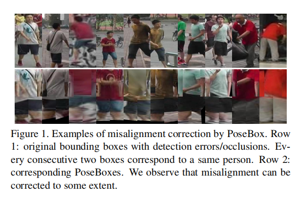
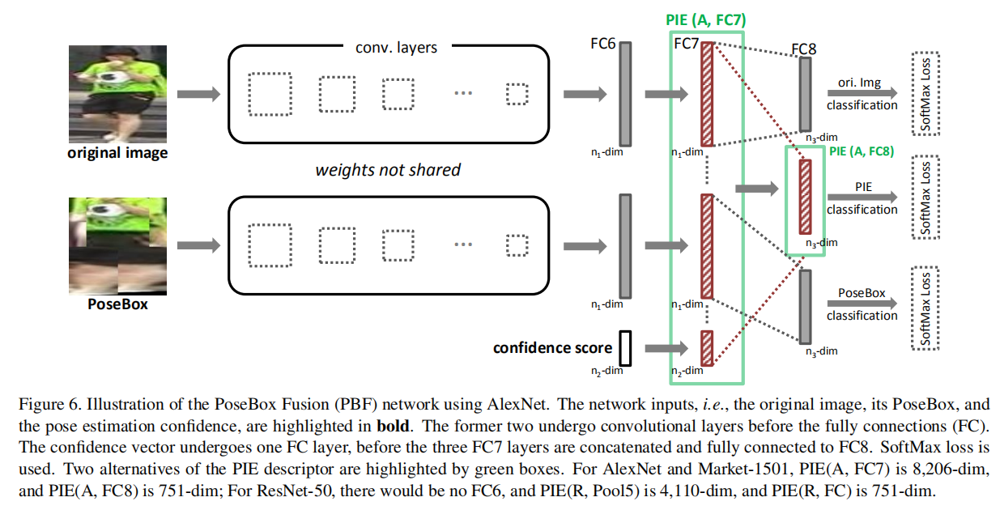
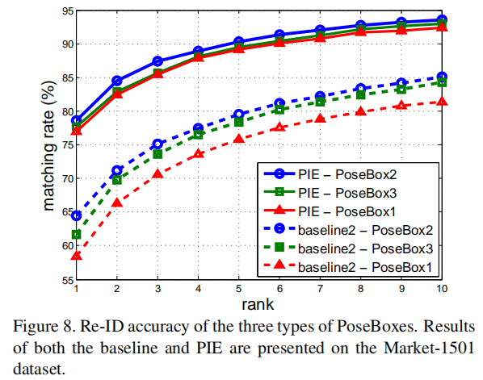
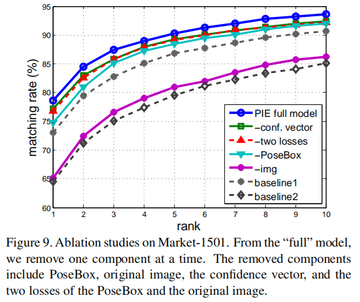
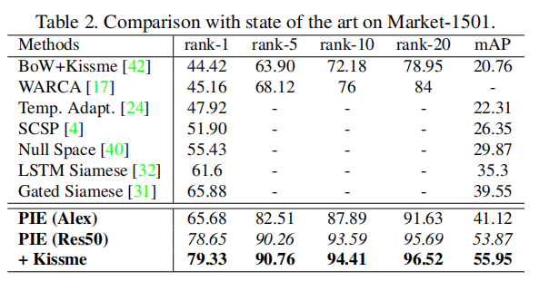
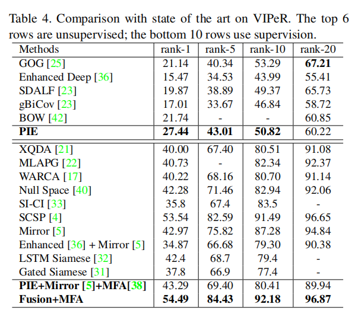

# Pose Invariant Embedding for Deep Person Re-identification

### author:Liang Zheng, Yujia Huang, Huchuan Lu, Yi Yang

## 摘要
行人未对准主要是由探测器错误和姿势变化引起的，对于健壮的人员重新识别（re-ID）系统而言，这是一个关键问题。为了解决这个问题，本文提出一种姿势不变嵌入方法（pose invariant embedding,PIE）方法作为行人描述符。首先为了对齐行人，提出一种PoseBox结构，然后为了减少PoseBox造成的姿态估计误差和信息损失，文章设计了一种PoseBox fusion（PBF）的CNN架构将原始图片、PoseBox、体态估计作为输入。最终的PIE描述符定义为PBF的全连接层。

## 简介
有很多影响ReID准确率的因素，例如检测/跟踪错误，光照变化，姿势，视点等。一个很大的影响因素就是行人未对准，主要可以归结为两点：（1）行人本来就有许多姿态，这到此bounding box不准确。如Fig1（2）检测错误

当行人对齐没做好的时候，ReID准确率会降低，例如在ReID中最常见的是水平切条处理，该方法在轻微的垂直未对准的情况下工作。在Fig1的第二行，人的头可能被匹配到未对准图片的背景上去，所以水平切条可能效果还更差。

作者之前的工作中[8,7]在同组考虑了未对准的问题，均使用了图片结构(pictorial structure,PS)，其中使用了和PoseBox相似的结构，还有和结合归一化body parts的想法类似，作者的工作落脚点为使用基于CNN的姿态估计和局部身体链接，并且PoseBox的组件与PS有所不同，大规模评估证明了这一点。另一个工作是匹配程序，尽管[8，7]并未讨论现实世界数据集中普遍存在的姿势估计误差，但我们表明，这些误差使刚性特征学习/匹配仅与PoseBox产生的结果相比于原始图像差，而三个流PoseBox融合网络可有效缓解此问题。

针对以上问题和有限的方法，本文提出一种姿势不变嵌入方法（PIE）作为鲁棒的描述符。一共有两步：（1）为每个行人外包矩形构造PoseBox，PoseBox描绘了具有标准直立姿势的行人。在姿势估计器的帮助下精心设计[34]，PoseBox的目的是产生对齐良好的行人图像，以便所学习的功能可以在剧烈的姿势变化下找到同一个人。作者使用标准的CNN架构[37、41、44]进行了单独训练，PoseBox产生非常不错的re-ID准确性。（2）为了减缓信息丢失和姿态估计错误的影响(Fig2)，PoseBoxc fusion(PBF)CNN模型被构建出来，三个输入分别是PoseBox、原始图片、姿态估计置信度。PBF在原始图像和PoseBox之间实现了全局优化的权衡。PIE被定义为PBF的全连接激活。

本文有三个贡献：
（1）提出了PoseBox，它与以前的工作具有相似的性质[8]。 它可以很好地匹配行人，并在单独使用时产生令人满意的re-ID性能（次要）

（2）姿势不变嵌入（PIE）被提议作为PoseBox Fusion（PBF）网络的一部分。 PBF将原始图像，PoseBox和姿势估计错误融合在一起，从而在姿势估计失败时提供一种回退机制（主要）

（3）使用PIE在Market-1501，CUHK03，VIPeR数据集上有很高的准确率。

## 相关工作

### 姿态估计

在DeepPose后，姿态估计从传统方法转向深度徐热西，当前的模型采取复杂尺度特征和学习机制来结合这些特好曾。通过调整一元分数和成对比较来注入人体关节之间的空间关系也是有效的。本文采取了卷积姿态机（convolution pose machines, CPM)来做姿态估计。

### ReID的深度学习

由于基于深度学习的模型有很好的效果，近两年基本支配了ReID社区。在两个早期工作中[20,39]，使用将两个图像作为输入的暹罗模型(siamese model)。在以后的工作中，以各种方式改进了该模型，例如注入更复杂的空间约束[1，6]，使用LSTM [32]建模身体部位的顺序属性，以及为不同的图像对挖掘判别匹配部位[31]。 siamese model只使用了简单的id标签。之前很多工作接受了分类模型。[41]中把视频帧作为每个人的训练样本，[37]中，有效的神经元被发明来每个训练域和新的dropout策略被提及。[36]中，手工提取的低层特征和FC+softmax整合到一起。本文的网络和[36]的比较相似，姿态估计分数与两个FC层整合到一起。

### ReID中的姿态

尽管在许多之前的工作中有提到姿态变化是ReID的影响因素，只有很少的文献中能找到他们之间联系的描述。Farenzena等[12]提出检测不同身体部位的对称轴并提取姿势变化后的特征。在[35]中，HOG检测器提供了上身定向的粗略估计，然后将上身渲染为关节3D模型的纹理。Bak等[3]进一步将每个人分为三种姿势类型：正面，背面和侧面。两项工作[3，9]均根据不同的测试姿势对应用视点特定的距离度量。最接近PoseBox的作品是[8，7]，它构造了绘画结构（PS），与PoseBox的概念相似。 他们使用传统的姿态估计器和手工制作的描述符，这些描述符在很大程度上不如CNN。 本文的工作采用了一整套更强大的技术，并设计了更有效的CNN结构，以大规模数据集上具有竞争力的re-ID准确性为证。

## 提出的方法

### PoseBox构造

PoseBox的构造分两步：

#### 姿态估计

本文接受了CPM，简而言之，CPM是顺序卷积体系结构，可强制执行中间监督以防止梯度消失。

#### 身体部位发现和仿射投影

从检测点根据检测到的关节，可以描绘出10个身体部位（Fig3)

#### 三种PoseBox

PoseBox1由躯干和两条腿组成。 腿由上腿和下腿组成。 PoseBox1包括两个最重要的身体部位，并且是其他两种PoseBox类型的基准

PoseBox2基于PoseBox1，本文进一步添加了左臂和右臂。 臂包括上臂和下臂子模块。 在本文的实验中，由于手臂带来的丰富信息，本文证明PoseBox2优于PoseBox1

PoseBox3在PoseBox 2的基础上，本文将头的box放在躯干的box顶部。在[8]中表明，包含头部带来了边际性能的提高。在本文的案例中，本文发现PoseBox3稍逊于PoseBox2，这可能是由于频繁的头颈部估计错误。

#### 备注

PoseBox的优点是双重的。 首先，可以校正姿势变化。 其次，可以大大消除背景噪音。 PoseBox也有两个方面的限制。 首先，姿势估计错误经常发生，导致关节的检测不精确。 其次，PoseBox是手动设计的，因此就信息丢失或重新ID准确性而言，不能保证它是最佳的。

### 基准

本文在原始行人图片和PoseBox上采用了两个baseline，AlexNet和Residual-50。

Baseline1：原始图片（resize到224*224）作为CNN的输入

Baseline2：PoseBox（resize到224*224）作为CNN的输入，每次只用一种PoseBox

### PBF网路

#### 动机

针对第一个问题（姿态估计错误）：通过置信度得分来大致预测姿势估计的质量

针对第二个问题（图像部分缺失）：通过重新引入原始图像来挽救丢失的视觉提示，从而使区分性细节被深度网络捕获

#### 网络

三流PoseBox Fusion网络，两个图片输入（原始图片、PoseBox）喂给CNN，因为两种图片的不同，两个CNN流的参数不共享。FC6和FC7两层都和这些conv层相连。参个FC7层串接到一起与FC8相连。三个Softmax loss的和就是最终的loss。

训练的时候，针对三种输入都喂进PBF，三个loss的和一起反向传播给卷积层。

在测试阶段，PIE作为描述符，使用欧拉距离来判断

PBF有三个优点：（1）置信度向量是PoseBox是否可靠的指标。 这提高了PBF作为静态嵌入网络的学习能力，因此可以在PoseBox和原始图像之间找到全局权衡（2）原始图像不仅在姿态估计失败时启用回退机制，而且还重新训练了在PoseBox构造过程中可能丢失的行人细节，但对识别身份很有用（3）PoseBox为原始图像提供了重要的补充线索。 使用正确预测的关节，行人匹配可以通过对齐良好的图像更加准确。 因此可以减少检测误差和姿势变化的影响。

## 实验

### 数据集

文章使用VIPeR,CUHK03,Market-1501

### 实验步骤

实验直接使用了现成的卷积位姿机（CPM），该机是使用在MPII人类位姿数据集上训练的多级CNN模型训练的使用AlexNet时，$n_1=4.96,n_2=14,n_3=751$，使用ResNet-50时，PBF中取消FC6层，FC7层用Pool5代替，$n_1=2048,n_3=751$。、

### 评估

#### 基准

#### PIE的有效性

#### 三种PoseBox的对比

#### Albation实验

#### 与SOTA的对比

## 总结

本文明确地解决了人员重新识别中的行人错位问题。提出姿势不变嵌入（PIE）作为行人描述符。 首先用卷积姿势机[34]检测到的16个关节构造PoseBox。 PoseBox可帮助纠正由摄像机视线，人的动作和检测器错误引起的姿势变化，并实现对齐的脚蹬Trian匹配。因此，通过PoseBox融合（PBF）网络学习了PIE，在该网络中，原始图像与PoseBox和姿势估计置信度融合在一起。PBF减少了在PoseBox构建过程中姿势估计错误和细节损失的影响。 证明PoseBox可以产生相当高的准确性，而与最新技术相比，PIE可以产生有竞争力的准确性。