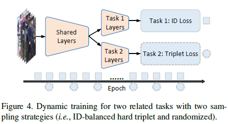
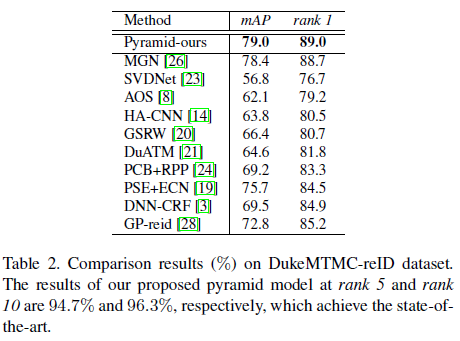

# Pyramidal Person Re-IDentification via Multi-Loss Dynamic Training

论文地址：http://openaccess.thecvf.com/content_CVPR_2019/papers/Zheng_Pyramidal_Person_Re-IDentification_via_Multi-Loss_Dynamic_Training_CVPR_2019_paper.pdf

## 摘要

motivation：针对行人检测模型出现的错误bound box对ReID算法的影响，提出金字塔模型缓解对bound box的依赖。

## 简介

### 基于局部特征模型的缺点

PCB是基于局部特征的典型，其实现了很高的新跟那个，但是具有两个缺点

（1）依赖于一个高效且鲁棒的行人检测模型输出的bound box
（2）很重要的全局信息被忽略了

### 多loss训练的困难

多任务学习被证明可以达到很好的性能。大多数的多任务模型选择给loss赋予权重，具有如下的问题：

（1）性能极其依赖于权重参数的选择

（2）不同任务的学习难度再梯度更新的同时也在改变

（3）由于特定的考虑，针对不同损失的采样策略通常是多种多样的。 例如，对tTriplet loss进行hard mining sample将抑制id loss

为了解决以上问题，本文提出一种基于特获赠图的金字塔模型。首先，金字塔模型实际上是一组具有特定的从粗到细体系结构的3维子图，其中每个成员都捕获不同空间比例的判别信息。 然后，使用卷积层减少金字塔中每个单独分支的特征尺寸。 第三，对于每个分支，将softmax函数的id loss独立地应用于将特征作为输入的全连接层。 此外，所有分支的特征将被连接起来以形成一个身份表示，定义了Triplet loss以了解更多区分性特征。 为了平稳地整合两个损失，探索了一种具有两种采样策略的动态训练方案，以优化深度神经网络的参数。

## 方法

### 金字塔模型

给定一个行人图片集$X = \{I_1,\dots,I_N\}$，本文的模型建立在用骨干网络$BN$获取的3维特征图$M$（$C * H * W$）上，其中$C$是通道数，$W$和$H$分别为宽度和高度。

首先将$M$水平分为$n$个parts，每个part的大小为：$C * (H/n) * W$。

金字塔模型是根据以下规则构造的：

（1）在金字塔的最低层（l=1），有n个分支，其中一个分支对应于一个基本部分

（2）较高级别的分支比先前较低级别的分支具有更多相邻的基本部分

（3）将所有级别的滑动步骤设置为1， 这意味着当前级别的分支数量仅比先前级别少一个

（4）在金字塔的顶层（l=n）中，只有一个分支，即原始特征图M

### 基本操作

对每个分支，先使用GMP和GAP捕获子图不同通道的特征，然后相加形成一个向量，再用卷积层+ReLU减少维度，为了使特征向量具有足够的可分辨性，基于Softmax的id loss将特征图作为输入的全连接层，与此同时对不同branch的所有特征向量联合的特征用triplet loss计算损失。

最后动态学习参数以降低两个loss

### 多loss动态训练

为了学习区分特征，我们采取了两项相关的任务，但强调了不同方面来学习嵌入f的参数，包括识别损失和三元组损失。 第一个是按点分类损失，第二个是按列表度量学习

#### ID Loss

使用分类损失

#### Triplet Loss

### 动态训练

大多数多任务方法通常使用平衡参数对任务进行加权，并将某些任务视为正则项。

在学习阶段，平衡参数在整个训练过程中是固定的

（1）性能严格取决于适当的参数，但是选择适当的参数无疑是一项劳动密集且棘手的工作

（2）随着模型的逐步更新，不同任务的难度实际上会发生变化，从而导致针对不同迭代的适用参数确实发生了变化

从ReID任务的角度来看，当两个任务直接组合在一起时，它们在某种程度上也存在冲突。 一方面，如果使用常规的随机小batch采样，那么有效的三元组很少见，这使得Triplet Loss对学习过程的贡献很小。 这是因为身份的数量很大，但是每个身份的图像数量很少。 另一方面，为避免此问题，采取一种ID平衡采样，以确保三元组确实存在于小batch中。 但是，此策略会抑制id loss，因为在每个微型批处理中可以使用的id较少。 由于采样偏差，某些图像可能无法始终使用。 因此，直接对loss进行算术加权将非常简单，但显然会导致优化上的许多困难。

#### 采样

为了解决该问题，我们选择动态地最小化这两种损耗，并相应地采用两种采样方法：随机采样和ID平衡难三元组采样。 随机采样很容易实现。ID平衡的硬三元组采样根据以下步骤：为了建立有效的三元组，我们为每个小批量随机选择8个身份，其中每个身份的8个图像是随机选择的。 因此，该策略绝对可以基于最大的类内（id）距离和最小的类间距离。 但是，不同身份的样本不平衡，并且永远不会使用图像数量少于8个的样本。

#### 动态权重

对于每项损失，我们定义了一个绩效指标来估计损失减少的可能性

假设$L_r^t$是当前训练轮次$r$对任务$t \in {id,tp}$的平均loss，可以根据以下公式将$k^t_r$计算为指数移动平均值：

$$k^t_r = \alpha L^t_r + (1-\alpha)k^t_{r-1}$$

其中$\alpha \in [0,1]$，且$k^t_{-1}=L^t_0$，基于$l^t_r$，定义一个描述loss减少的可能性

$$p^t_r = \frac{min(k^t_r,k^t_{r-1})}{k^t_{r-1}}$$

如果损失偶尔增加，则使用函数min将pt归一化为1。显然，$p^t_r = 1$表示当前的优化步骤尚未减少损失。 值越大，任务t的优化达到局部最小值的可能性越大。 类似于“焦点损失”，它可以对较容易的样本进行权重处理，而将重点放在难样本上，我们定义了一种对损失进行加权的度量$(FL(.))$：

$$FL(p^t_r, \lambda) = -(1-p^t_r)^{\lambda}log(p^t_r)$$

$\lambda$用于控制价聚焦强度，$FL(p^t_r,\lambda)$设计来给不同任务赋权并选择目标loss来优化。

$$L = \sum_{t \in \{id,tp\}}FL(p^t_r,\lambda)L^t_r$$

由于采样策略不同，本文优化了ID Loss，当$FL(p^{id}_r,\lambda)$主导两个任务$(FL(p^{tp}_r,\lambda)/FL(p^{id}_r,\lambda)<\delta)$时，具有随机选择的小批处理的。

实际上，$FL(p^{id}_r,\lambda)$总是在早期优化中占主导地位，因为每一步都可以大大减id loss。 此外，由于该模型目前处于不成熟状态，因此所有样本都同样困难，因此基于难采样的Triplet Loss不能对优化起关键作用。 这类似于自定进度，在该方案中，首先训练更简单的样本，然后考虑难样本，而在此动态优化两个任务起着相同的作用。

## 实验

