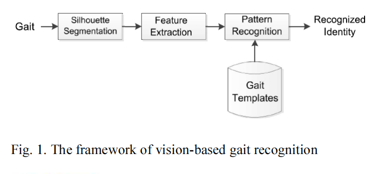
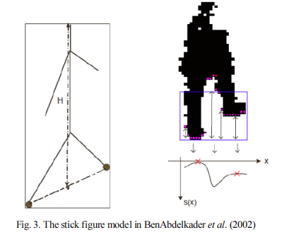
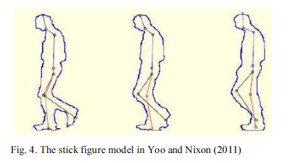
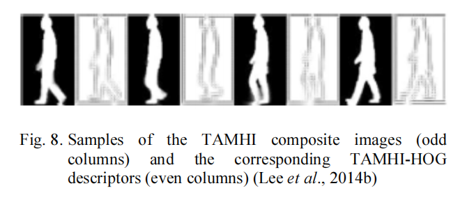
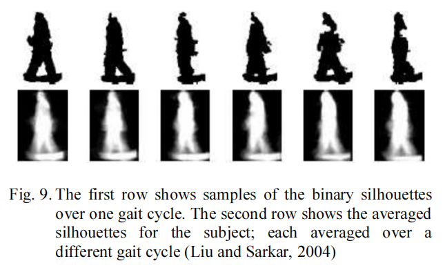
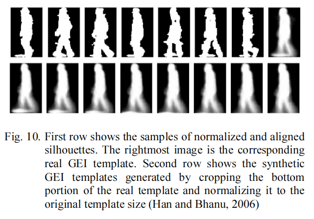
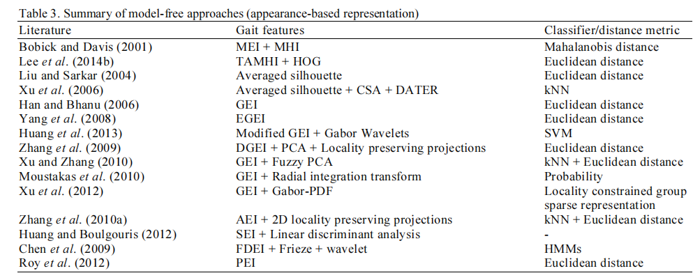
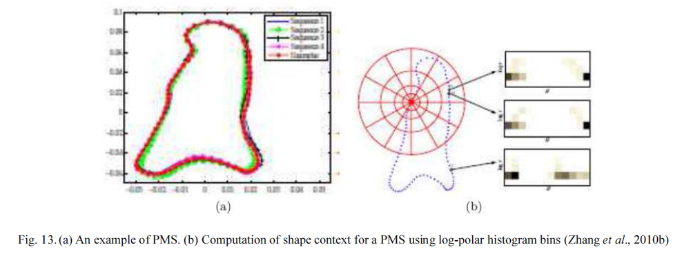

# Review on Vision-Based Gait Recognition Representations Classification Schemes and Datasets

### author:Chin Poo Lee, Alan Wee Chiat Tan and Kian Ming Lim

2017 Chin Poo Lee, Alan Wee Chiat Tan and Kian Ming Lim. This open access article is distributed under a Creative 
Commons Attribution (CC-BY) 3.0 license. 

## 摘要

文章主要总结了步态特征提取、分类模式和标准步态数据库三个方面。有两种主要的最先进的方式：基于模型的（对人体模型化）和非基于模型（不需要对人体建模）的。

## 介绍

基于视觉的步态识别算法基本框架

### 剪影提取

主要使用背景剪除法

### 特征提取

基于模型的和基于非模型的

#### Model-Based Approaches

使用人体成分或运动的模型参数（例如运动轨迹，肢体长度，肢体角速度等）来描述步行模式两种常用的步态表示是结构模型(Structural Model)和运动模型(Motion Model)

##### Structural Model

对人体各部位使用直线、骨架、椭圆等建立模型

##### Motion Model

#### Model-Free Approaches

直接从步态图像中抽取特征，主要分为：基于外表(appearance-based)、基于转换(transformation-based)、基于分布(disteribution-based)三种描述。

##### Appearance-Based Representation

步态的运动被计算为能量图，能量值高的区域运动越频繁。

MHI的问题在于当出现自遮挡的时候，就很难描述运动方向。

2014年有人提出一个时间平均运动历史图像(TAMHI)，他们将步态周期分为几个规则的时间窗口，以生成复合图像，以更好地保存瞬态信息。然后用HOG特征算子计算步态特征。

接下来Liu和Sarkar（2004）提出了一种平均轮廓法，将耦合子空间分析（Coupled Subspace Analysis CSA）作为去除噪声的预处理步骤，并应用带有张量表示的判别分析（ Discriminant Analysis with Tensor Representation DATER）来增强判别能力

类似于平均轮廓法，Han and Bhanu (2006)提出了步态能量图（Gait Energy Image GEI）

Yang et al. (2008)构建了动态权重蒙版(dynamics weight mask)以增强动态区域与其他区域之间的对比度，提出了EGEI(Enhance GEI)

Zhang et al. (2009)提出对GEI的动态部分单独提取出来DGEI(Dynamic Gait Energy Image)，然后使用主成分分析降维再使用局部性投影。

Xu（2012年）将每个GEI表示为一组局部Gabor特征，结合了不同方位和比例的Gabor特征，使用全局高斯混合模型（GMM）进行特征学习。

Hu(2014)，把GEI描述为一组双树复数小波变换（Dual-Tree Complex Wavelet Transform DTCWT）特征。

Choudhury and Tjahjadi (2015) 计算GEI的熵，然后使用高斯滤波器进行多尺度形状分析

Zhang et al. (2010a) 提出一种Active Energy Image (AEI) 计算相邻两张图片的差，通过二维局部性保留投影（2DLPP）方法将每个AEI投影到子空间上。

Huang and Boulgouris (2012)将序列图像分为三块：头，身，腿。提出Shifted Energy Image (SEI) 根据各自的水平中心对齐每个区域

Chen et al. (2009) 提出主能量图Dominant Energy Image (DEI)，将步态周期分为不同的簇，每个簇可计算一个DEI，对群集的DEI和连续帧之间的帧差的正部分求和，然后，生成帧的帧差能量图Frame Difference Energy Image（FDEI）

Roy et al. (2012) 提出了姿态能量图Pose Energy Image (PEI)，提取每个步态周期的关键姿态

##### Transformation-Based Representation

主要采用主成分分析（PCA）和傅里叶变换

###### PCA
PCA的加强中有一种使用Procrustes形状分析将轮廓边界转换为特征空间以获得Procrustes平均形状(PMS)，再用形状上下文描述符来衡量两个PMS的相似度。

Zheng(2011)对GEI向量采用偏最小二乘回归以生成最佳特征向量。通过将PCA应用于最佳特征向量来获得视图转换模型（View Trasnformation Model VTM）

Kusakunniran(2011)提出成对形状配置Pairwise Shape Configuration (PSC)，随后又提出高阶形状配置Higher-order Shape Configuration (HSC)

###### Fourier

对变形轮廓边界进行傅立叶变换提取步态特征，主要是关键帧的特征提取

###### Distribution-Based Representation

基于分布的描述：常用的有光流分布，概率分布和基于纹理的分布

在光流向量中可以捕获运动强度和运动方向信息，为了实现抗噪声的鲁棒性，采用离散化流向并制定基于直方图的方向表示的方法。Gait Flow Image (GFI) 

多分辨率局部二值模式(Local Binary Patterns LBP)可以编码时空局部二值直方图

### 模式识别与分类

在给定观察到的未知类步态特征的情况下，从已知类库中识别出最佳匹配

主要使用KNN、对于时序数据使用的动态时间规整DTW(Dynamic Time Warping)、同样针对时序数据的隐马尔可夫模型(hidden Markov Model HMM)、支持向量机(Support Vector Machines SVM)

复杂的多分类模式识别问题都会被简化为二分类

神经网络也是一种常用的分类模型、特征重叠的情况下经常使用模糊逻辑，